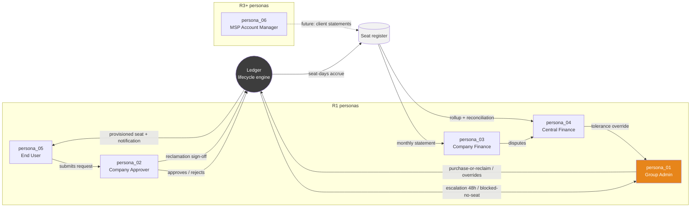

# Step 2 — CX Personas: Ledger (`fcostudios__smp`)

> **Date:** 2026-07-22 · **Language:** en-US (workspace DEC-003; product UI is bilingual es/en per DEC-SMP-004)
> **RAW_INPUT:** `PRD.md` (Ledger PRD v2.2 — §7 Personas & Roles, §10 lifecycle, §11 Modules A–I, §18 risks) · `PRODUCT_BRIEF.md` · `v1/01_research.md` (AS-IS actors §2.3, pains §3, sizing §11) · `extracts/01_research_sizing.json` (persona_seeds).
> Zero-hallucination rule: every attribute cites its input. Personas are **role personas** grounded in the PRD's confirmed operating reality — no invented demographics beyond what inputs support.
> Release legend: 🟢 R1 · 🟡 R2 · 🔴 R3+.

---SECTION: SEC0---

## Executive Summary

Six personas emerge from the input — five active in R1 and one future (R3+). They are defined by the PRD's persona table [(input_ref: "Persona / Role in the lifecycle / Primary needs" — PRD §7)] and sharpened by the AS-IS research: today the entire process funnels through one person [(input_ref: "Group Admin (Francisco): single point of console access; de-facto approver, provisioner, and pool manager. Bottleneck and bus factor." — 01_research §2.3)].

**Major patterns:**

1. **One operator, many consumers.** The Group Admin is the only persona who touches the Anthropic console; every other persona interacts exclusively with Ledger's workflow surfaces (queue, statements, request form). This asymmetry is the product's reason to exist [(input_ref: "requests wait on whoever holds console access" — PRD §4)].
2. **Approval and money are separated by design.** Company Approvers decide seat requests; Company Finance Admins and Central Finance consume the financial output. No persona both approves and reconciles [(input_ref: PRD §7 rows "Company Approver", "Company Finance Admin", "Central Finance")].
3. **Scoped visibility is the trust contract.** Company-scoped personas must see only their company; the Group Admin and Central Finance see across all 30 [(input_ref: "Company-scoping enforced server-side on every query; Group Admin sees all, company roles see only their company." — PRD Module A)].
4. **Two languages, one register.** Statements and approvals serve Ecuadorian finance teams and GMs (es-EC voice); the platform owner and some end users work comfortably in English — hence bilingual UI (DEC-SMP-004) [(input_ref: "30 Ecuadorian companies under QPH group; QPH voice is Spanish" — DECISION_MATRIX DEC-SMP-004)].
5. **Trust is earned at the monthly close.** The Finance personas' adoption hinges on the first parallel-run close producing defensible numbers [(input_ref: "Parallel-run month (weeks 5–6) is the trust-building device" — 01_research §7.2)].

**Key CX differences that impact design:** the Approver needs a zero-training, SLA-driven queue (they are a GM, not an IT person); the Finance personas need traceability (statement line → register row → raw payload) more than dashboards; the End User needs status visibility to stop the chat-chasing habit; the Group Admin needs exception surfaces (blocked requests, drift, pool alerts) — not more console tabs.

---SECTION: SEC1---

## Persona Identification

### persona_01 — Group Admin / Platform Owner ("Francisco") 🟢
Operates the platform across all 30 companies: pools, credentials, exceptions, escalations. The current process bottleneck who must become its supervisor.
**Mindset quote (paraphrase-locked to input):** "Cross-company visibility, pool management, exception handling, audit trail." [(input_ref: PRD §7 — "Group Admin / Platform Owner (Francisco) / Operates the platform; final escalation; manages seat pool and Anthropic credentials / Cross-company visibility, pool management, exception handling, audit trail")]

### persona_02 — Company Approver 🟢
GM or IT lead of one company; decides seat requests for their people under a 2-business-day SLA with reminder/escalation pressure.
**Mindset quote:** "Simple approval queue, context on cost impact, delegation during absence." [(input_ref: PRD §7 — "Company Approver / Approves/rejects seat requests for their company (typically GM or IT lead)")]

### persona_03 — Company Finance Admin 🟢
Receives and scrutinizes their company's monthly statement; needs joiners/leavers detail and (🟡) budget-vs-actual.
**Mindset quote:** "Accurate statement, joiners/leavers detail, budget-vs-actual view for their company only." [(input_ref: PRD §7 row "Company Finance Admin")]

### persona_04 — Central Finance 🟢
Reconciles the consolidated Anthropic invoice against the rollup; owns the 0.5% tolerance and its override; exports to accounting.
**Mindset quote:** "Consolidated rollup, reconciliation report, export to accounting." [(input_ref: PRD §7 row "Central Finance"; "central finance owns the tolerance override" — PRD §18)]

### persona_05 — End User (Employee) 🟢
Requests a seat (or is requested on their behalf), waits for access, wants status without chasing.
**Mindset quote:** "Simple request form, status visibility, notification when access is ready." [(input_ref: PRD §7 row "End User (employee)")]

### persona_06 — MSP Account Manager 🔴
Future persona managing externally billed client companies; requires hard isolation and client-ready statements. Not built in R1/R2; shapes architecture only.
**Mindset quote:** "Strict per-client isolation, client-ready statements." [(input_ref: PRD §7 — "MSP Account Manager (future) … drives Phase 4+ requirements only")]

---SECTION: SEC2---

## Persona Archetypes

| Attribute | persona_01 Group Admin | persona_02 Company Approver | persona_03 Company Finance | persona_04 Central Finance | persona_05 End User | persona_06 MSP AM 🔴 |
|---|---|---|---|---|---|---|
| Role in process | Platform operator; final escalation; pool + credential manager [(PRD §7)] | Decision-maker per company [(PRD §7)] | Statement consumer, company-scoped [(PRD §7)] | Invoice reconciler, cross-company [(PRD §7)] | Requester/subject of provisioning [(PRD §7)] | Client-portfolio manager [(PRD §7)] |
| Org position | Central shared services [(01_research §1.1 "IT/platform administration … is central")] | GM or IT lead of one of 30 companies [(PRD §7)] | Finance team of one company [(PRD §4 "the numbers reported to each company's finance team")] | Group-level finance [(PRD §4 "central finance … one consolidated Anthropic invoice")] | Employee of any of the 30 companies [(PRD §4)] | Future external-facing role [(PRD §7)] |
| Tools today | Anthropic console(s), chat, email, spreadsheets [(01_research §2.4)] | Chat/email; "sometimes a GM says yes; often skipped" [(01_research §2.2 A3)] | Excel + email; reconstructed figures [(01_research §2.2 A9)] | Excel invoice split [(01_research §2.2 A9)] | Chat ("chase via chat") [(01_research §2.3)] | n/a (future) |
| Knowledge level | High — platform + vendor internals; "digitally capable (AI-assisted build in-house)" [(01_research §11.0)] | Medium; non-technical management profile [(inferred from "typically GM or IT lead" — PRD §7; flagged as inference)] | Medium; finance-literate, not technical [(inferred from role; flagged)] | Medium-high; owns tolerance/variance analysis [(PRD Module E)] | Medium; general workforce [(no further evidence in input)] | High (future) |
| Dependencies | Primary-owner key creation per org [(PRD §16 Sprint 0 gate)]; approvers deciding in SLA [(PRD Module B)] | Notifications + queue; Group Admin override behind them [(PRD Module B "Group Admin override")] | Close job on business day 3 [(PRD Module E)] | Statements + rollup + invoice entry [(PRD Module E)] | Approver decision; pool availability [(PRD §10 "Blocked: No Seat")] | R3+ isolation features [(PRD §6 non-goals)] |
| Language | es/en [(DEC-SMP-004; brief §6 "es-EC primary voice")] | es [(DEC-SMP-004; brief §6 "es-EC primary voice")] | es [(same)] | es [(same)] | es/en [(same)] | es/en (future) |
| Primary device | Desktop [(inferred: console + admin workloads; flagged)] | Desktop + mobile (approvals arrive by email; aging pressure implies on-the-go acks) [(inferred from Module B notifications; flagged)] | Desktop [(statement/CSV/PDF work — PRD Module E)] | Desktop [(same)] | Mobile + desktop [(inferred: request + status check; flagged)] | Desktop (future) |
| Demographics | No evidence found in input (role persona; individual known: Francisco, platform owner) | No evidence found in input | No evidence found in input | No evidence found in input | No evidence found in input | No evidence found in input |

---SECTION: SEC3---

## Goals and Motivations

**persona_01 Group Admin 🟢**
- Stop being the bottleneck: requests flow without his touch on the happy path [(input_ref: "an Anthropic invite is created within 15 minutes … with zero manual admin steps" — PRD Module B AC)].
- Keep pools healthy and purchases deliberate [(input_ref: "purchase or reclaim decision task for the Group Admin showing current inactive-seat candidates … next to the prorated cost" — PRD Module C)].
- Sleep well on audit: every transition recorded [(input_ref: "Immutable audit log: every state transition, approval decision, API call" — PRD Module H)].
- **Success =** exceptions-only involvement; drift events 0 [(input_ref: "Provisioning actions outside the platform (drift events) / 0 after go-live" — PRD §17)].

**persona_02 Company Approver 🟢**
- Decide fast with context (who, why, cost impact, budget headroom) [(input_ref: "context on cost impact" — PRD §7; "budget headroom check (soft warning)" — PRD Module B)].
- Not get escalated: decision within 48 h [(input_ref: "reminder to approver at 24 h, escalation to Group Admin at 48 h" — PRD Module B)].
- Control reclamation for their people — no silent removals [(input_ref: "Reclamation proposal, never silent removal" — PRD §10)].
- **Success =** empty queue, no escalations, no surprise charges on their statement.

**persona_03 Company Finance Admin 🟢**
- A statement that survives scrutiny: joiners/leavers with dates, seat-days × rate [(input_ref: "per-company statement — opening seats, joiners (with dates), leavers (with dates), seat-days × rate" — PRD Module E)].
- Budget position visibility (🟡) [(input_ref: "Budget vs. actual per company with 75/90/100% threshold alerts" — PRD Module E P1)].
- **Success =** zero disputes raised; statement accepted on receipt.

**persona_04 Central Finance 🟢**
- Rollup that reconciles to the invoice within tolerance, with explained variance [(input_ref: "target match within 0.5%, with a line-level variance explanation" — PRD Module E)].
- Statements by business day 3, every month [(input_ref: "Monthly close (by business day 3)" — PRD Module E)].
- **Success =** month flagged "reconciled" without override; export lands in accounting unchanged [(input_ref: "flags the month 'reconciled' only within the 0.5% tolerance or with an explicit Group Admin override note" — PRD Module E AC)].

**persona_05 End User 🟢**
- Get access quickly and know where the request stands [(input_ref: "Seat request → active seat in ≤ 1 business day" — PRD G1; "status visibility" — PRD §7)].
- **Success =** provisioning-complete notification with getting-started note [(input_ref: PRD Module B — "provisioning-complete notification with getting-started note")].

**persona_06 MSP Account Manager 🔴**
- Per-client isolation and client-ready statements [(input_ref: PRD §7)]. No further R1 evidence — shapes architecture only.

---SECTION: SEC4---

## Frustrations and Pains

**persona_01 Group Admin 🟢**
- Every request lands on him via chat; pool status is guesswork ("400-on-invite is the de-facto pool check") [(input_ref: 01_research §2.2 A4)].
- Pending invites silently consume seats [(input_ref: "track pending invites (they consume seats)" — PRD Module C; "nobody tracks pending invites" — 01_research §2.1)].
- Beta-API anxiety: automation could regress under him [(input_ref: "User Management API is beta and may change or regress" — PRD §18)].
- Bus factor is himself [(input_ref: "Single-developer bus factor" — PRD §18; "Bottleneck and bus factor" — 01_research §2.3)].

**persona_02 Company Approver 🟢**
- Today there is no queue at all — approvals are verbal and unrecorded [(input_ref: "Approval (implicit) … Sometimes a GM says yes; often skipped … none recorded" — 01_research §2.2 A3)].
- Risk of being blamed for costs they never approved [(input_ref: "Chargeback disputes between companies" — PRD §18)].
- Absence blocks their company (delegation is 🟡) [(input_ref: "Delegation (out-of-office approver)" — PRD Module B P1)].

**persona_03 Company Finance Admin 🟢**
- Numbers arrive "reconstructed by hand, late, and disputed" [(input_ref: PRD §4)].
- No way to verify a charge today; no per-company view exists [(input_ref: "no per-company view" — 01_research §3.1 Technology)].

**persona_04 Central Finance 🟢**
- Owns the manual invoice split and the disputes it creates [(input_ref: "finance receives one consolidated Anthropic invoice with no per-company breakdown" — PRD §4; "allocates the invoice by hand; owns the disputes" — 01_research §2.3)].
- Mid-cycle proration and invite-consumed seats create unexplained variance [(input_ref: "line-level variance explanation (mid-cycle proration, invite-consumed seats, timing)" — PRD Module E)].

**persona_05 End User 🟢**
- Requests disappear into chat threads; no status; invites expire silently [(input_ref: "Message eventually reaches whoever holds Anthropic console access" — 01_research §2.1; "invites silently expire" — 01_research §2.2 A6)].
- Blocked requests are invisible: seat exhaustion just looks like silence [(input_ref: PRD §10 "Blocked: No Seat … requester and Group Admin notified" — the TO-BE fix implies today's silence)].

**persona_06 MSP AM 🔴** — No evidence found in input beyond isolation/statement needs (future).

---SECTION: SEC5---

## Behaviors and Insights

- **persona_01** works console-first today and must shift to exception-first: his R1 surfaces are the cross-company dashboard, blocked/failed queues, pool alerts, drift claims, credential health [(input_ref: PRD Module F "Cross-company dashboard: seats purchased / assigned / pending / free; … requests in flight by state; inactive-seat count; freshness indicators")]. Decision trigger: alerts, not inbox. Communication: direct, technical, bilingual.
- **persona_02** is interrupt-driven: email notification → decide → back to their real job. Decision triggers: new-request email, 24 h reminder [(input_ref: PRD Module B notifications + aging)]. They will judge the product by whether a decision takes < 1 minute with cost context present. Approve/reject with mandatory comment on reject [(input_ref: "approve/reject + mandatory comment on reject" — PRD Module B)].
- **persona_03/04** are calendar-driven (monthly close rhythm) and evidence-driven: their core behavior is *verification* — statement line → register row → dates [(input_ref: "Any statement figure traceable to register rows and raw API payloads within the UI" — PRD §15 Auditability)]. Disputes flow to central finance, who owns the tolerance override [(input_ref: PRD §18)].
- **persona_05** behaves like a consumer: request → status page → notification. The habit to extinguish is chat-chasing [(input_ref: "chase via chat" — 01_research §2.3)].
- **Cross-persona insight:** every persona except the End User consumes *lists with states and dates* (queues, registers, statements). The UI's dominant pattern is the stateful table with drill-down evidence — consistent with the QPH DS's clean, uncluttered, structural-gray aesthetic [(input_ref: "Lots of white space, clear hierarchy, few elements per view" — QPH DS readme, via DEC-SMP-005 seed)].

---SECTION: SEC6---

## Persona Comparison

| Dimension | Group Admin | Approver | Company Finance | Central Finance | End User |
|---|---|---|---|---|---|
| Scope of visibility | All 30 companies + all orgs [(PRD Module A)] | Own company queue [(PRD Module B)] | Own company statements [(PRD Module F)] | All statements + rollup [(PRD Module E)] | Own requests only [(PRD §7)] |
| Frequency | Daily [(alerts/exceptions — PRD Modules C/D/G)] | Episodic (per request + monthly reclamation) [(PRD Modules B/D)] | Monthly [(PRD Module E)] | Monthly, deadline-bound [(PRD Module E)] | Rare (request + status) [(PRD §7)] |
| Primary object | Pools, exceptions, credentials | Request | Statement | Reconciliation | Own request |
| Core anxiety | Beta API regression; drift; bus factor [(PRD §18)] | Being escalated; blame for cost [(PRD Module B; §18)] | Wrong charges [(PRD §4)] | Unexplained variance [(PRD Module E)] | Silence [(01_research §2.1)] |
| Success metric | Drift = 0; exceptions-only [(PRD §17)] | Decisions < 48 h [(PRD Module B)] | Zero disputes [(PRD §18)] | ≤ 0.5% variance [(PRD G3)] | Seat ≤ 1 bd [(PRD G1)] |
| System implication | Exception dashboard + audit | One-click queue + delegation 🟡 | Traceable statement viewer | Reconciliation workbench | Status page + notifications |

**Persona ecosystem map (D1):**



---SECTION: SEC7---

## CX Opportunities

- **Approver one-minute decision:** queue item shows requester, company, justification, needed-by, cost impact, budget headroom in one card; approve/reject inline [(input_ref: PRD Module B P0 fields + "context on cost impact" — PRD §7)]. 🟢
- **End-user status transparency:** public state per request mirroring the §10 machine (Submitted → Pending Approval → … → Active), with notifications at each transition [(input_ref: PRD Module B notifications; §10 states)]. 🟢
- **Blocked-no-seat honesty:** when the pool is empty, tell the requester and show the Group Admin the reclaim-vs-buy choice — never silence [(input_ref: "the request is never silently dropped" — PRD Module C AC)]. 🟢
- **Statement traceability drill-down:** every line opens its register rows and dates; disputes become lookups, not arguments [(input_ref: PRD §15 Auditability; §18 "Statements trace to register rows and dates in the UI")]. 🟢
- **Freshness labeling as UI element:** usage figures carry as-of dates; staleness alerts self-report [(input_ref: "every usage figure displays its as-of date (Analytics data lags ~3 days)" — PRD Module D)]. 🟢
- **Reclamation with dignity:** inactivity flags become *proposals* to the approver, with last-active dates [(input_ref: "shown per company with last-active date; feeds the reclamation flow" — PRD Module D; "never silent removal" — §10)]. 🟢
- **Delegation + bulk approvals** for approver absence and onboarding batches [(input_ref: PRD Module B P1)]. 🟡
- **Weekly digest** for the Group Admin (pool, aging, inactivity, renewals) [(input_ref: PRD Module F P1)]. 🟡

---SECTION: SEC8---

## Impact on Process

- **Time-to-complete:** the Approver is the human latency budget (≤ 2 bd of the ≤ 1 bd-after-free-seat goal is governed by their SLA + aging) [(input_ref: PRD §10 Pending Approval "Decision target ≤ 2 business days"; G1)]. End-to-end automation removes the Group Admin from the happy path entirely [(input_ref: Module B AC "zero manual admin steps")].
- **Errors:** Finance personas' dispute rate is the error signal; the register's gap/overlap DB constraint eliminates the class of double-attributed seat-days [(input_ref: "gaps and overlaps are validation errors" — PRD Module E; DEC-SMP-009)].
- **Bottlenecks:** AS-IS bottleneck is persona_01 by construction [(input_ref: 01_research §2.3)]; TO-BE bottleneck moves to approver responsiveness — mitigated by aging/escalation and (🟡) delegation [(input_ref: PRD Module B)].
- **Communication breakdowns:** chat-thread loss is replaced by state notifications; drift alerts catch out-of-band console actions within one sync cycle [(input_ref: "Hourly member sync reconciles console vs. register; drift raises an alert and a claim task" — PRD §18)].
- **Compliance risks:** unrecorded approvals disappear — every decision carries who/when/comment [(input_ref: "Approval recorded (who, when, comment)" — PRD §10; Module H audit)].
- **System usability stakes by persona:** Approver (non-technical, episodic) sets the usability bar; Finance sets the trust bar; Group Admin sets the completeness bar. A failure with any of the three reverts the group to chat [(input_ref: AS-IS description — PRD §4; behavioral basis SEC5)].

---SECTION: SEC9---

## Recommendations

- **Role-specific home surfaces (R1):** Group Admin → cross-company dashboard + exception queues; Approver → approval queue; Finance → statements; Central Finance → reconciliation workbench; End User → my-requests status. Matches PRD Module F's two-view split plus role landing [(input_ref: PRD Module F P0 rows)]. 🟢
- **Server-side scoping as the trust primitive:** company scoping on every query, with the isolation test suite the NFR demands [(input_ref: "company_id scoping with mandatory automated test coverage — highest-severity bug class" — PRD §15)]. 🟢
- **Bilingual by role reality (DEC-SMP-004):** es-first labels for Approver/Finance surfaces; en available everywhere; statement/PDF language per OQ-SMP-9 (decide Step 5/7). 🟢
- **Email-first notifications** (all R1 personas live in email; Slack/Teams notification webhooks are 🟡, Module G P1; Slack/Teams approval actions are 🔴, Module B P2) [(input_ref: PRD Module G P0 "Email delivery"; P1 webhooks)]. 🟢
- **Design-system implication for Step 6:** stateful tables + evidence drill-downs + status chips dominate; QPH's rationed-orange, structural-gray language fits (orange = the one action/alert accent per view) [(input_ref: "Orange is rationed: one accent action/highlight at a time" — QPH DS readme via DEC-SMP-005)]. 🟢
- **Risks mitigated:** approver absence (delegation 🟡), statement disputes (traceability 🟢), silent failure (freshness + alert log 🟢), bus factor (exception-driven ops + runbooks 🟢) [(input_ref: PRD §18 table)].
- **Quick wins:** approval queue + status page (Sprint 1, orchestration mode). **Long-term:** MSP isolation (🔴) — keep `company_id` scoping strict now so persona_06 costs a feature, not a rewrite [(input_ref: "precondition for ever hosting externally billed clients" — PRD §15)].

---SECTION: SEC10---

## Personas_Directory (Machine-Friendly Index)

```json
[
  {
    "id": "persona_01",
    "name": "Group Admin / Platform Owner",
    "summary": "Central operator of Ledger across all 30 companies and all Anthropic orgs; manages seat pools, credentials, exceptions, and escalations. Currently the manual bottleneck; becomes exception-first supervisor.",
    "role": "Platform operator: pool management, purchase-or-reclaim decisions, credential rotation, drift claims, final escalation, audit oversight",
    "key_pains": ["Every request funnels through him via chat; pool status is guesswork", "Pending invites silently consume seats", "Beta-API regression risk and personal bus factor"],
    "key_goals": ["Exceptions-only involvement with drift events at 0 after go-live", "Healthy per-org pools with deliberate purchases (reclaim-before-buy)", "Complete immutable audit trail"],
    "evidence_refs": ["PRD sec7 row Group Admin", "PRD Module C purchase-or-reclaim task", "PRD sec17 drift metric", "01_research sec2.3 bottleneck and bus factor"]
  },
  {
    "id": "persona_02",
    "name": "Company Approver",
    "summary": "GM or IT lead of one company who approves or rejects seat requests under a 2-business-day SLA with reminder at 24h and escalation at 48h; also signs off reclamations.",
    "role": "Per-company decision-maker in the request workflow and reclamation flow",
    "key_pains": ["No queue exists today - approvals are verbal and unrecorded", "Risk of blame for costs never approved", "Absence blocks their company until delegation ships (R2)"],
    "key_goals": ["Decide in under a minute with cost and budget context present", "Never get escalated (respond within 48h)", "Control reclamation for their people - no silent removals"],
    "evidence_refs": ["PRD sec7 row Company Approver", "PRD Module B aging and escalation", "PRD sec10 reclamation proposal never silent removal", "01_research sec2.2 A3 implicit approval"]
  },
  {
    "id": "persona_03",
    "name": "Company Finance Admin",
    "summary": "Finance contact of one company who consumes the monthly statement; needs joiners/leavers with dates and seat-days-times-rate detail; budget-vs-actual arrives in R2.",
    "role": "Company-scoped statement consumer and first line of chargeback verification",
    "key_pains": ["Numbers today are reconstructed by hand, late, and disputed", "No way to verify a charge - no per-company view exists"],
    "key_goals": ["A statement that survives scrutiny on receipt (zero disputes)", "Budget position visibility with threshold alerts (R2)"],
    "evidence_refs": ["PRD sec7 row Company Finance Admin", "PRD Module E statement composition", "PRD sec4 reconstructed numbers", "01_research sec3.1 data pains"]
  },
  {
    "id": "persona_04",
    "name": "Central Finance",
    "summary": "Group-level finance role that reconciles the consolidated Anthropic invoice against the Ledger rollup, owns the 0.5% tolerance and its override, and exports to accounting.",
    "role": "Cross-company reconciler and dispute arbiter; deadline-bound to business day 3",
    "key_pains": ["Owns the manual invoice split and the disputes it creates today", "Mid-cycle proration and invite-consumed seats create unexplained variance"],
    "key_goals": ["Rollup reconciles within 0.5% or with line-level explanation", "Statements out by business day 3 every month", "Clean export to accounting"],
    "evidence_refs": ["PRD sec7 row Central Finance", "PRD Module E reconciliation view", "PRD Module E AC reconciled flag", "01_research sec2.2 A9 invoice allocation"]
  },
  {
    "id": "persona_05",
    "name": "End User (Employee)",
    "summary": "Employee of any of the 30 companies who requests a Claude seat (or has one requested on their behalf), tracks status, and gets notified when access is ready.",
    "role": "Requester and subject of provisioning; consumer of status visibility",
    "key_pains": ["Requests disappear into chat threads with no status", "Invites and pool exhaustion fail silently today"],
    "key_goals": ["Active seat within 1 business day when a seat is free", "Always know the request state without chasing", "Getting-started notification on provisioning"],
    "evidence_refs": ["PRD sec7 row End User", "PRD G1 target", "PRD Module B notifications", "01_research sec2.1 AS-IS flow"]
  },
  {
    "id": "persona_06",
    "name": "MSP Account Manager",
    "summary": "Future (R3+) persona managing externally billed client companies; requires strict per-client isolation and client-ready statements. Shapes architecture (company_id scoping) but has no R1 surfaces.",
    "role": "Future client-portfolio manager for externally billed companies (MSP mode)",
    "key_pains": ["No evidence in input beyond isolation and statement needs (future role)"],
    "key_goals": ["Strict per-client isolation", "Client-ready statements with markup support"],
    "evidence_refs": ["PRD sec7 row MSP Account Manager (future)", "PRD sec15 isolation precondition", "PRD sec12 Later column MSP features"]
  }
]
```
