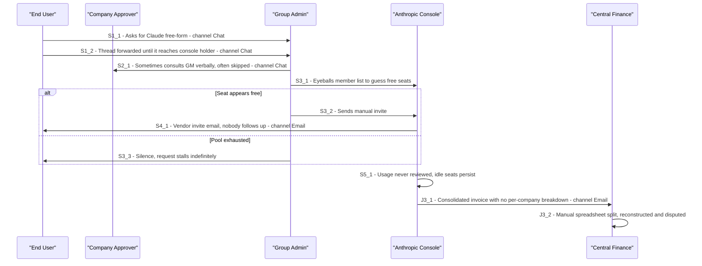
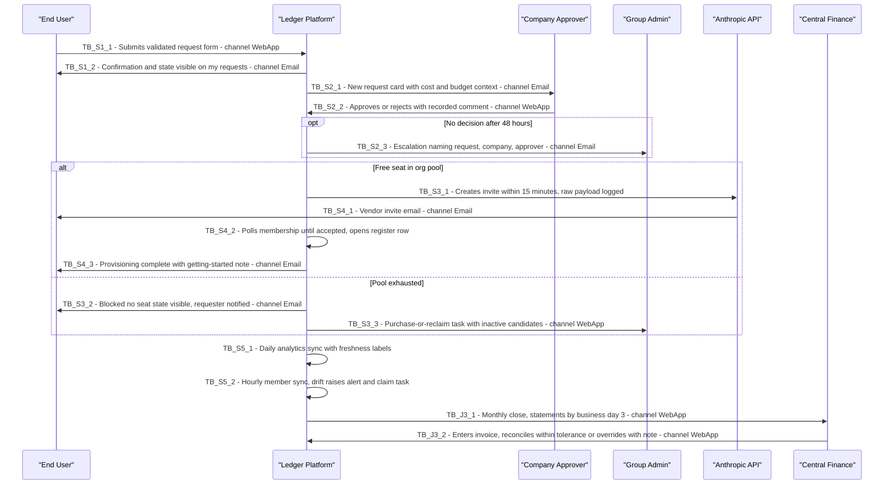

# 03 — CX Journeys (AS-IS + TO-BE): Ledger

**Project:** Ledger (`fcostudios__smp`)
**Step:** 3 — CX Journeys · **Date:** 2026-07-22 · **Report language:** en-US (spec convention; product UI bilingual es/en per DEC-SMP-004)
**PRIOR_WORK:** `PRODUCT_BRIEF.md` · `PRD.md` (§4 problem, §10 lifecycle, §11 Modules A–I, §16 roadmap) · `v1/01_research.md` (AS-IS §2, pains §3) · `v1/02_cx_personas.md` (persona_01..06)

> **PERSONA_FOCUS:** primary = persona_05 End User + persona_02 Company Approver (the seat-request journey is the product's spine). Secondary journeys: persona_01 Group Admin (reclamation + pool/exception ops) and persona_04/03 Finance (monthly close).
> **PROCESS_FOCUS:** the §10 seat lifecycle end-to-end (request → approval → provision → monitor → reallocate → deprovision) plus the Module E monthly close. Vendor #1 = Claude; journeys are written vendor-neutrally so R2+ vendors reuse them (DEC-SMP-008).
> Release legend: 🟢 R1 · 🟡 R2 · 🔴 R3+.

---

---SECTION: SEC0---

## Executive Summary

- **Focus:** four journeys — **J1 Seat Request** (persona_05 + persona_02, 🟢 primary, detailed S1–S5), **J2 Reclamation & Offboarding** (persona_01 + persona_02, 🟢), **J3 Monthly Close & Reconciliation** (persona_04 + persona_03, 🟢), **J4 Pool & Exception Operations** (persona_01, 🟢). All four are stages of one lifecycle over one register.
- **AS-IS narrative:** every journey today runs over chat/email against the Anthropic console with zero durable records [(input_ref: "every step — request, approval, invitation, removal — happens over chat and email against the Anthropic admin console")].
- **Main stages (J1):** S1 Submit Request → S2 Approval Decision → S3 Provisioning → S4 Acceptance & Activation → S5 Active Use & Monitoring.
- **Top AS-IS pains:** requests vanish into threads [(input_ref: "Message eventually reaches whoever holds Anthropic console access")]; approvals unrecorded [(input_ref: "Sometimes a GM says yes; often skipped … none recorded")]; pool status is guesswork [(input_ref: "400-on-invite is the de-facto pool check")]; invoice split reconstructed and disputed [(input_ref: "reconstructed by hand, late, and disputed")].
- **CX opportunity themes:** one structured intake with validations; one-minute approver decisions with cost context; honest blocked-no-seat state; statement lines that open their evidence; freshness labels everywhere; reclamation as proposal, never silent removal.
- **Expected impact:** request→seat ≤ 1 business day (≤ 15 min post-approval automated); statements by business day 3 reconciling ≤ 0.5%; drift → 0; ≥ 90% active seats [(input_ref: PRD §17 targets)]. `ASSUMPTION`: adoption follows the first successful parallel close (validated weeks 5–6 — SEC8 A-J5).

---SECTION: SEC1---

## Context & Scope

**Business / Process Context.** Ledger is the system of record for SaaS license lifecycle + chargeback across ~30 companies under QPH central management [(input_ref: "no system of record connecting a seat to the company that uses it")]. The journey matters because the AS-IS is already failing at 30 companies and blocks external billing later [(input_ref: "At 30 companies this is already failing; the intent to add externally billed client companies later makes a proper system of record unavoidable")].

**Journey Focus.** J1 follows an employee's seat request through approval and provisioning to active use; J2 follows a seat back out (inactivity/departure/transfer); J3 follows the money (close → statements → reconciliation); J4 follows the operator's exception surface (blocked requests, low pool, drift).

**Scope Boundaries.** J1 starts at need recognition and ends at Active with a getting-started note; J2 starts at an inactivity flag/departure signal and ends at Deprovisioned + pool return; J3 starts at close trigger (business day 1–3) and ends at "reconciled" flag + export; J4 is continuous (alert-driven). OUT OF SCOPE: seat *purchase* execution (vendor-UI-only [(input_ref: "Seat inventory is bought and reduced only in Anthropic's UI")]) — Ledger opens the decision task and records the outcome; formal invoicing; IdP/SSO flows (`ASSUMPTION` none exist to model — D2 confirms no SCIM today).

**Input Availability.** CONTEXT_AND_TASK (brief + PRD) ✅ · RAW_RESEARCH (01_research) ✅ · PERSONAS_MAP (02_cx_personas) ✅ · PROCESS_FOCUS ✅. Weak evidence: real per-company request volumes and current cycle times are unmeasured [(input_ref: "request lead time unknown (days-to-weeks)")] — flagged in SEC8.

---SECTION: SEC2---

## Persona Focus & Scenario

| Persona | Role in Journey | Key Goals | Main Frustrations | Key Behaviors | Evidence |
|---|---|---|---|---|---|
| persona_05 End User | J1 protagonist: requests, waits, activates | Seat ≤ 1 bd; know the state; getting-started note | Requests vanish; silence on blockage | Consumer-like: request → status → notification | [input_ref: "Simple request form, status visibility, notification when access is ready"] |
| persona_02 Company Approver | J1/J2 decision-maker | Decide < 1 min with context; never escalated; control reclamations | No queue today; blame risk; absence blocks (🟡 delegation) | Interrupt-driven from email; approve/reject + comment | [input_ref: "Simple approval queue, context on cost impact, delegation during absence"] |
| persona_01 Group Admin | J2/J4 operator; J1 exception path | Exceptions-only; drift 0; healthy pools | Bottleneck today; pending invites eat seats; beta-API anxiety | Alert-driven; console-first → exception-first | [input_ref: "Cross-company visibility, pool management, exception handling, audit trail"] |
| persona_04 Central Finance | J3 protagonist | ≤ 0.5% variance; bd-3 statements; clean export | Manual split; unexplained proration variance | Calendar-driven verification | [input_ref: "Consolidated rollup, reconciliation report, export to accounting"] |
| persona_03 Company Finance | J3 verifier | Statement survives scrutiny; budget view 🟡 | Late, disputed numbers; no per-company view | Evidence-driven drill-down | [input_ref: "Accurate statement, joiners/leavers detail, budget-vs-actual view"] |

**Narratives.**
- *End User:* an employee at one of the 30 companies needs Claude for their work. Emotional posture: mild urgency, aversion to chasing [(input_ref: "chase via chat")]. Success = working seat with zero follow-up messages.
- *Approver:* a GM/IT lead juggling a real job; approvals are interruptions. Posture: wants context, fears blame for costs [(input_ref: "Chargeback disputes between companies")]. Success = queue at zero, no escalations.
- *Group Admin:* the current do-everything operator. Posture: wants out of the happy path, anxious about beta API and drift [(input_ref: "User Management API is beta and may change or regress")]. Success = touches exceptions only.
- *Finance pair:* deadline-bound verifiers. Posture: skeptical until the first defensible close [(input_ref: "Parallel-run month (weeks 5–6) is the trust-building device")]. Success = "reconciled" without override.

**Scenario Definition (J1 primary).** Trigger: employee needs Claude [(input_ref: "an employee needs Claude")]. Objective: active, attributed seat with zero manual admin steps on the happy path [(input_ref: "with zero manual admin steps (automated mode)")]. Success criteria (persona view): End User — seat ≤ 1 bd + notifications at each transition; Approver — decision made once, with context, inside SLA.

---SECTION: SEC3---

## End-to-End Journey Overview (Stages — J1 primary)

One sentence: a request enters a validated intake, waits only on one recorded decision, then flows automatically (or via checklist) into an attributed, monitored seat.

| Stage ID | Stage Name | Persona Main Goal | Entry Trigger | Exit Condition / Outcome | Evidence |
|---|---|---|---|---|---|
| S1 | Submit Request | Get the need registered correctly first try | Employee need; admin-on-behalf | Request in **Submitted** → auto-validated to **Pending Approval** | [input_ref: "Request created by end user or by a company admin on their behalf (name, email, company, seat type, justification)"] |
| S2 | Approval Decision | One-minute informed decision | Queue notification to approver | **Approved** (or **Rejected** with comment); escalation at 48 h | [input_ref: "Waiting on the company's designated approver; Group Admin can approve any request"] |
| S3 | Provisioning | Seat materializes without human touch | Approval recorded; free seat exists | Invite created ≤ 15 min → **Invited**; else **Blocked: No Seat** branch | [input_ref: "Provisioning attempt within 15 minutes"] |
| S4 | Acceptance & Activation | Start working; know it's ready | Invite email from vendor | User accepted, member sync confirms → **Active**; register row opens | [input_ref: "→ Invited → Active when the user accepts and first appears as a member"] |
| S5 | Active Use & Monitoring | Keep the seat by using it | Seat active | Continuous; seat-days accrue; inactivity windows watch | [input_ref: "Member holds a seat; usage monitored (Module D); seat-days accrue to the company in the register"] |

---SECTION: SEC4---

## Detailed Journey by Stage (AS-IS vs TO-BE)

#### Stage S1 – Submit Request

**Stage Narrative (AS-IS).** The employee messages someone — their manager, IT, or Francisco directly — and hopes. The ask carries no structured data; threads get forwarded until they reach the console holder or die [(input_ref: "Chat/email ask, free-form"; "Thread forwarded until it reaches console holder")]. Emotion: hopeful → resigned.

**Stage Table (AS-IS).**

| Step # | Step Description (AS-IS) | Channels / Touchpoints | Emotions (1–5) | Pain Points (AS-IS) | Backstage Processes / Systems | Evidence |
|---|---|---|---|---|---|---|
| 1 | Employee asks for Claude in chat/email, free-form | WhatsApp, email | 3 – Hopeful | No structure; no record; duplicates undetected | none | [input_ref: "Chat/email ask, free-form"] |
| 2 | Thread forwarded until it reaches the console holder | Chat forwarding | 2 – Uncertain | Routing loss; no owner; no SLA | none | [input_ref: "Thread forwarded until it reaches console holder"] |

**Stage Table (TO-BE).**

| Improvement # | TO-BE Description | CX Benefit | Effort | Owner / Area | Related Pain Points | Assumption? |
|---|---|---|---|---|---|---|
| 1 | Request form (self or admin-on-behalf): requester, company pre-filled/suggested, justification, needed-by; validations: not already seated, domain plausible, company active, budget headroom soft-warn | First-try correct intake; duplicates blocked with pointer to existing assignment | Med | Module B | S1 both | No [(input_ref: "Submitting runs validations: person not already seated, email domain plausible for company, company active, budget headroom check (soft warning)")] |
| 2 | Submission confirmation to requester + state visible on "my requests" | Kills chase-by-chat | Low | Module B/F | S1-2 | No [(input_ref: "submission confirmation to requester")] |

#### Stage S2 – Approval Decision

**Stage Narrative (AS-IS).** There is no approval stage — sometimes a GM is consulted verbally, often not; nothing is recorded [(input_ref: "Sometimes a GM says yes; often skipped … none recorded")]. Emotion (approver): unaware → later blamed.

**Stage Table (AS-IS).**

| Step # | Step Description (AS-IS) | Channels | Emotions | Pain Points | Backstage | Evidence |
|---|---|---|---|---|---|---|
| 1 | Verbal/implicit approval, or none | Chat, hallway | 2 – Exposed | Unrecorded; inconsistent; blame later | none | [input_ref: "Approval (implicit) … often skipped"] |

**Stage Table (TO-BE).**

| # | TO-BE Description | CX Benefit | Effort | Owner | Related Pains | Assumption? |
|---|---|---|---|---|---|---|
| 1 | Per-company approval queue; card shows requester, justification, needed-by, cost impact, budget headroom; approve/reject inline, mandatory comment on reject | One-minute informed decision; recorded who/when/comment | Med | Module B | S2-1 | No [(input_ref: "Approval queue per company approver, with approve/reject + mandatory comment on reject")] |
| 2 | New-request email to approver; reminder 24 h; escalation to Group Admin 48 h (configurable) | Never a silent stall; SLA pressure without nagging humans | Low | Module B/G | S2-1 | No [(input_ref: "reminder to approver at 24 h, escalation to Group Admin at 48 h")] |
| 3 | Group Admin override for any request | Absence never blocks a company (full delegation 🟡) | Low | Module B | S2-1 | No [(input_ref: "Group Admin override; full history on every request")] |

#### Stage S3 – Provisioning

**Stage Narrative (AS-IS).** The console holder eyeballs the member list, guesses whether a seat is free, and sends an invite; a 400 error is the pool check. If no seat exists, the request just stalls silently [(input_ref: "Console glance; purchased vs assigned counted by eye"; "400-on-invite is the de-facto pool check")]. Emotion: (admin) burdened; (requester) in the dark.

**Stage Table (AS-IS).**

| Step # | Step Description (AS-IS) | Channels | Emotions | Pain Points | Backstage | Evidence |
|---|---|---|---|---|---|---|
| 1 | Admin checks console, guesses pool | Anthropic console | 2 – Burdened | Guesswork; per-org consoles; no telemetry | Anthropic console per org | [input_ref: "Seat check … counted by eye"] |
| 2 | Manual invite sent (if seat free) | Anthropic console | 3 – Relieved | Single operator; unlogged; lowest-tier auto-assignment | Anthropic console | [input_ref: "Manual console invite"] |
| 3 | Pool empty → silence | none | 1 – Abandoned | Request dies invisibly | none | [input_ref: "seat exhaustion just looks like silence"] |

**Stage Table (TO-BE).**

| # | TO-BE Description | CX Benefit | Effort | Owner | Related Pains | Assumption? |
|---|---|---|---|---|---|---|
| 1 | On approval: automated `POST /v1/organizations/invites` within 15 min; all calls logged with raw request/response | Zero-touch happy path; audit-grade evidence | Med | Module C | S3-1/2 | No [(input_ref: "on approval, POST /v1/organizations/invites with role user")] |
| 2 | Orchestration mode fallback: step-by-step console checklist + admin confirmation + sync verification ("verification failed" if sync disagrees) | Beta regression degrades speed, never blocks; identical states both modes | Med | Module C | S3-2 | No [(input_ref: "the engine issues a step-by-step checklist to the admin … Ledger then verifies against the member list on next sync")] |
| 3 | Pool empty → **Blocked: No Seat** state + requester/Group Admin notified + purchase-or-reclaim task with inactive candidates next to prorated cost | Honest blockage; reclaim-before-buy decision support | Med | Module C | S3-3 | No [(input_ref: "the request enters Blocked: No Seat, the pool alert fires, and a purchase-or-reclaim task is created — the request is never silently dropped")] |

#### Stage S4 – Acceptance & Activation

**Stage Narrative (AS-IS).** Nobody follows up invites; they silently expire while consuming a seat [(input_ref: "Acceptance follow-up: None; invites silently expire")]. Emotion: (requester) confused; (admin) unaware.

**Stage Table (AS-IS).**

| Step # | Step Description (AS-IS) | Channels | Emotions | Pain Points | Backstage | Evidence |
|---|---|---|---|---|---|---|
| 1 | User accepts invite — or doesn't; nobody knows | Vendor email | 2 – Confused | Expired invites eat seats for weeks | Anthropic invite system | [input_ref: "nobody tracks pending invites (which consume seats)"] |

**Stage Table (TO-BE).**

| # | TO-BE Description | CX Benefit | Effort | Owner | Related Pains | Assumption? |
|---|---|---|---|---|---|---|
| 1 | Invite polling → **Invited → Active** on membership confirmation; register row opens at activation; requester gets provisioning-complete + getting-started note | Closure for the requester; attribution starts at truth | Med | Module C/E | S4-1 | No [(input_ref: "poll membership until accepted"; "provisioning-complete notification with getting-started note")] |
| 2 | Invite hygiene: alert at 7 days unaccepted; auto-withdraw after configurable window, freeing the seat + re-notifying requester | Seats never leak into limbo | Low | Module C | S4-1 | No [(input_ref: "alert on invites unaccepted after 7 days; auto-withdraw (freeing the seat) after a configurable window")] |

#### Stage S5 – Active Use & Monitoring

**Stage Narrative (AS-IS).** Usage is never reviewed; idle seats persist; departures leak seat-days [(input_ref: "Usage is never reviewed; idle seats persist indefinitely; departures are deprovisioned late or never")].

**Stage Table (AS-IS).**

| Step # | Step Description (AS-IS) | Channels | Emotions | Pain Points | Backstage | Evidence |
|---|---|---|---|---|---|---|
| 1 | Seat used (or not); nobody watches | — | 3 – Indifferent | Idle seats invisible; no attribution accrual | none | [input_ref: "Usage review: None"] |

**Stage Table (TO-BE).**

| # | TO-BE Description | CX Benefit | Effort | Owner | Related Pains | Assumption? |
|---|---|---|---|---|---|---|
| 1 | Daily Analytics sync (chat/Code/Cowork per user/day), rolled up; freshness label on every figure (~3-day lag); staleness alert > 48 h | Trustworthy usage picture that self-reports staleness | Med | Module D | S5-1 | No [(input_ref: "every usage figure displays its as-of date (Analytics data lags ~3 days); staleness alert when sync is > 48 h behind")] |
| 2 | 30/60/90-day inactivity flags per company with last-active date → feeds J2 | Idle seats become reclaim candidates, visibly | Low | Module D | S5-1 | No [(input_ref: "Inactivity flags at 30/60/90 days without qualifying activity")] |
| 3 | Hourly member sync + drift alert + claim task (assign bypassed seat retroactively) | Console bypass surfaced ≤ 1 h; register stays truthful | Med | Module D | S5-1 | No [(input_ref: "discrepancies surface as alerts, since drift means someone bypassed the workflow")] |

**Secondary journeys (condensed stage lists — detailed treatment deferred to screens/scope steps):**

- **J2 Reclamation & Offboarding 🟢** (persona_01 + persona_02 + persona_05 affected): R1 = flag→ **Flagged Inactive** → reclamation proposal to approver (never silent) → approve → **Offboarding** → API removal/checklist → **Deprovisioned**, register row closes with reason, pool increments [(input_ref: "→ Deprovisioned (member removed / seat unassigned via API or checklist); freed seat returns to pool")]. Departure variant: same-business-day SLA [(input_ref: "Departure-driven: same business day")]. Transfer 🟡 chains deprovision + fast-tracked provision, pre-approved when same-company [(input_ref: "A one-click 'transfer' action in the UI chains the two and pre-approves the inbound leg")]. Cross-org move = two operations, seat stays in origin pool [(input_ref: "Cross-org 'moves' are explicitly two operations — the freed seat stays in its own org's pool")].
- **J3 Monthly Close & Reconciliation 🟢** (persona_04 + persona_03): close by bd 3 → per-company statements (opening, joiners/leavers with dates, seat-days × rate, usage charges) + rollup → company verification via drill-down (statement line → register rows) → invoice entry → variance view → "reconciled" flag within 0.5% or explicit override note recorded by Central Finance (override authority under OQ-SMP-11 — see DECISION_MATRIX) → CSV/PDF export [(input_ref: "per-company statement — opening seats, joiners (with dates), leavers (with dates), seat-days × rate"; "flags the month 'reconciled' only within the 0.5% tolerance or with an explicit Group Admin override note")]. Mid-month transfer splits appear on both statements with dates [(input_ref: "company A is charged seat-days through the 9th and company B from the 10th, and the person appears on both statements with dates")].
- **J4 Pool & Exception Operations 🟢** (persona_01): continuous surface of blocked requests, failed provisioning, low-pool alerts per org (floor default 5), purchase-or-reclaim tasks, invite-hygiene alerts, drift claims, credential health, freshness state [(input_ref: "low-pool alert below a configurable floor (default 5) per org"; "API-credential health check distinguishing auth failure from genuinely empty data")]. Purchase execution itself happens in the vendor UI per runbook; Ledger records the outcome [(input_ref: "Seat purchase runbook")].

---SECTION: SEC5---

## Cross-Persona & Cross-Channel Comparison

**Persona Comparison.**

| Persona | Key Strengths in Journey | Key Vulnerabilities / Pain Points | Unique Needs | Evidence |
|---|---|---|---|---|
| End User | Simple goal; tolerant if informed | Abandoned by silence (S1, S3-blocked, S4) | Status page + transition notifications | [input_ref: "status visibility"] |
| Approver | Local knowledge for good decisions | Interrupt-driven; absence stalls company (🟡 delegation) | One-card context; email-actionable flow | [input_ref: "context on cost impact"] |
| Group Admin | Total context; can override anything | Overload if exceptions aren't triaged; beta-API failures land on him | Exception queues + runbooks + audit | [input_ref: "exception handling, audit trail"] |
| Central Finance | Owns tolerance authority | Deadline-bound; variance without explanation | Reconciliation workbench + line-level variance | [input_ref: "line-level variance explanation (mid-cycle proration, invite-consumed seats, timing)"] |
| Company Finance | Motivated verifier | Received-numbers skepticism | Drill-down traceability | [input_ref: "Statements trace to register rows and dates in the UI"] |

**Channel Comparison.**

| Channel / Touchpoint | Role in Journey | Strengths (CX) | Weaknesses / Risks | Evidence |
|---|---|---|---|---|
| Ledger web app | System of record; all queues/registers/statements | Scoped, stateful, auditable | New habit to form; must beat chat's convenience | [input_ref: "Company-scoping enforced server-side on every query"] |
| Email | R1 notification backbone for every persona | Universal; SLA-compatible (reminders/escalations) | One-way; deep links must land on the right scoped view | [input_ref: "Email delivery for: pending-approval aging/escalation, provisioning failure…"] |
| Anthropic console | Vendor execution surface (orchestration mode; purchases) | Authoritative for vendor state | Company-blind; per-org; bypass source (drift) | [input_ref: "reallocation … remove/re-invite within the same pool"; "someone provisions directly in the Anthropic console"] |
| Vendor invite email | S4 activation touchpoint | Native vendor UX | Outside Ledger's control; expiry leaks seats | [input_ref: "invites unaccepted after 7 days"] |
| Chat (WhatsApp) | AS-IS everything; TO-BE nothing official | Familiar | The habit to extinguish; Slack/Teams actions are 🔴 | [input_ref: "Slack/Teams approval actions" (P2)] |

**Cross-cutting insights.** (1) Every persona's trust depends on the same register — one data structure serves five journeys. (2) The approver's 48 h SLA is the only human latency on the happy path; everything else is jobs. (3) Silence is the AS-IS failure mode everywhere; the TO-BE answer is states + notifications, not dashboards. (4) The console remains in the loop (orchestration, purchases) — the design must absorb it, not pretend it away. (5) Freshness labeling converts a vendor limitation (3-day lag) into displayed honesty.

---SECTION: SEC6---

## Key CX Opportunities & Quick Wins

- **O1 – Validated intake with duplicate block (S1)** · Personas: End User, Approver · Impact: kills routing loss + duplicate seats · Effort: Med · Deps: Company/Person registry (Module A) · Evidence: [input_ref: "submission is blocked with a message identifying the existing assignment"] · Assumption?: No
- **O2 – One-card approval queue with aging (S2)** · Approver · Impact: decisions < 1 min, SLA met without human nagging · Effort: Med · Deps: notifications (Module G) · Evidence: [input_ref: "Aging: reminder to approver at 24 h, escalation … at 48 h"] · No
- **O3 – Zero-touch provisioning ≤ 15 min (S3)** · End User, Group Admin · Impact: the headline speed promise · Effort: Med · Deps: Anthropic connector, credentials · Evidence: [input_ref: "an Anthropic invite is created within 15 minutes … zero manual admin steps"] · No
- **O4 – Honest Blocked-No-Seat + purchase-or-reclaim (S3)** · All · Impact: converts the worst AS-IS failure (silence) into a governed decision · Effort: Med · Deps: pool tracking per org · Evidence: [input_ref: "never silently dropped"] · No
- **O5 – Invite hygiene (S4)** · Group Admin · Impact: stops seat leakage into limbo · Effort: Low · Deps: connector polling · Evidence: [input_ref: "auto-withdraw (freeing the seat)"] · No
- **O6 – Freshness-labeled monitoring + drift claims (S5)** · Group Admin, Finance · Impact: trustworthy data + bypass visibility ≤ 1 h · Effort: Med · Deps: Analytics + member sync jobs · Evidence: [input_ref: "no silent staleness"] · No
- **O7 – Reclamation-as-proposal (J2)** · Approver, End User · Impact: seat efficiency without fear (≥ 90% active target) · Effort: Med · Deps: inactivity flags · Evidence: [input_ref: "Reclamation proposal, never silent removal"] · No
- **O8 – Statement drill-down traceability (J3)** · Finance pair · Impact: disputes become lookups · Effort: Med · Deps: register + close job · Evidence: [input_ref: "Any statement figure traceable to register rows and raw API payloads within the UI"] · No
- **O9 – Reconciliation workbench with tolerance override (J3)** · Central Finance · Impact: bd-3 close, ≤ 0.5% or explained · Effort: Med · Deps: invoice entry, close · Evidence: [input_ref: "reconciliation view shows total variance and per-line contributors"] · No
- **O10 – One-click transfer 🟡 (J2)** · Approver, Group Admin · Impact: same-pool reallocation without ceremony · Effort: Low · Deps: J2 core · Evidence: [input_ref: "A one-click 'transfer' action"] · No

**Quick Wins (Sprint 1, orchestration mode):** O1 + O2 (+ manual register entries + pool counter + audit log) deliver a working, valuable product before any API code [(input_ref: "Usable in orchestration mode end-to-end — the platform delivers value even before API automation")]; O5 configuration shell; email templates for all Module G P0 alerts.

---SECTION: SEC7---

## Risks, Constraints & Dependencies

| Risk | Area | Likelihood | Mitigation |
|---|---|---|---|
| Beta UM API change/regression mid-journey (S3/S4/J2) | Technical | Med [(input_ref: "User Management API is beta and may change or regress")] | Orchestration mode permanent; raw payloads; centralized version/beta headers |
| Approver non-adoption (queue ignored) | Organizational | Med `ASSUMPTION` | Aging + escalation + Group Admin override; email-first UX; delegation 🟡 |
| Finance rejects first close numbers | Organizational | Med `ASSUMPTION` | Parallel-run month; line-level variance; drill-down evidence |
| Console bypass persists (drift ≠ 0) | Operational | Med [(input_ref: "someone provisions directly in the Anthropic console")] | Hourly sync + claim tasks; restrict console access to Group Admin |
| Pool exhaustion under 20-seat minimums per carve-out org | Operational/Financial | Med [(input_ref: "Every carve-out org carries its own 20-seat minimum and strands freed seats")] | Per-org alerts; utilization data to motivate consolidation |
| Analytics lag misleads reclamation | Data | Low [(input_ref: "activity data is ~3 days behind")] | 30/60/90-day windows; freshness labels; no auto-action on activity alone |
| Compliance constraints | Regulatory | — | None in input beyond audit/2FA/encryption (Module H); statements are not legal invoices |

**Dependencies:** org inventory + per-org keys (OQ-SMP-1, gates Sprint 0); approver roster (OQ-SMP-5, gates go-live); rate card values (OQ-SMP-4, gates Sprint 3); hosting (OQ-SMP-7).

---SECTION: SEC8---

## Validation Plan & Data Gaps

| Assumption ID | Description | Where Used | Proposed Validation | Priority |
|---|---|---|---|---|
| A-J1 | Approvers will act from email within SLA once queue exists | SEC4 S2, SEC7 | Sprint-1 pilot with 3–5 companies; measure decision latency | High |
| A-J2 | Finance adoption hinges on first parallel close | SEC0, SEC7 | Weeks 5–6 parallel run; count disputes | High |
| A-J3 | Request volumes are low enough for single approver per company | SEC4 S2 | OQ-SMP-5 roster + volume telemetry from Sprint 1 | Med |
| A-J4 | No IdP/SSO flows to model (D2: no SCIM today) | SEC1 scope | Confirm during Sprint 0 org inventory | Med |
| A-J5 | Impact statement (adoption after first close) | SEC0 | Same as A-J2 | Med |
| A-J6 | Delegation demand is real (approver absence) | SEC5 | Observe escalation frequency in month 1 | Low |

**Data Gaps:** actual request volume/cycle-time baseline (unmeasured AS-IS) — capture from Ledger's own telemetry from day 1; per-org seat counts/renewals (OQ-SMP-1); statement language preference per company (OQ-SMP-9 → Step 5/7).

**Next Research Steps:** (1) complete org inventory (OQ-SMP-1); (2) confirm approver roster (OQ-SMP-5); (3) collect 2–3 past months of Anthropic invoices for reconciliation back-testing; (4) pilot queue usability with 2 approvers on Sprint-1 build; (5) decide statement language (OQ-SMP-9) with 2–3 finance contacts.

---SECTION: SEC9---

## Input Traceability (Evidence Map)

| Insight / Claim | Journey Section / Stage | Supporting Input | Source Block |
|---|---|---|---|
| Everything runs over chat/email vs console today | SEC0, SEC4 all AS-IS | [input_ref: "every step — request, approval, invitation, removal — happens over chat and email against the Anthropic admin console"] | RAW_RESEARCH (PRD §4) |
| Approval is implicit and unrecorded | SEC4 S2 | [input_ref: "Sometimes a GM says yes; often skipped … none recorded"] | RAW_RESEARCH (01_research §2.2 A3) |
| Pool status is guesswork; 400 = pool check | SEC4 S3 | [input_ref: "400-on-invite is the de-facto pool check"] | RAW_RESEARCH (01_research §2.2 A4) |
| Pending invites consume seats silently | SEC4 S4 | [input_ref: "nobody tracks pending invites (which consume seats)"] | RAW_RESEARCH (01_research §2.1) |
| Blocked requests must never drop silently | SEC4 S3 TO-BE, O4 | [input_ref: "the request is never silently dropped"] | CONTEXT_AND_TASK (PRD Module C AC) |
| Reclamation is proposal, never silent removal | J2, O7 | [input_ref: "Reclamation proposal, never silent removal"] | CONTEXT_AND_TASK (PRD §10) |
| Statement traceability is the dispute killer | J3, O8 | [input_ref: "Any statement figure traceable to register rows and raw API payloads within the UI"] | CONTEXT_AND_TASK (PRD §15) |
| Mid-month transfer splits across two statements | J3 | [input_ref: "company A is charged seat-days through the 9th and company B from the 10th"] | CONTEXT_AND_TASK (PRD Module E AC) |
| Cross-org move = two operations | J2 | [input_ref: "the freed seat stays in its own org's pool"] | CONTEXT_AND_TASK (PRD §9) |
| Trust built at first parallel close | SEC7, SEC8 | [input_ref: "Parallel-run month (weeks 5–6) is the trust-building device"] | RAW_RESEARCH (01_research §7.2) |

---SECTION: SEC10---

---SECTION: SEC11---

---SECTION: SEC12---

## Data Entities & Data Flow (Early View)

**Candidate Data Entities** (seed for Step 4 — aligned to PRD §14 vendor-neutral core):

| Entity Name | Type | Description | Key Business Role in Journey | Evidence / Assumption |
|---|---|---|---|---|
| Company | Master | One of the ~30 managed companies; code used on statements | Scoping + attribution target | [input_ref: "Company records: name, code (used on statements), type internal/external, status, designated approver(s), finance contact, monthly Claude budget"] |
| Person | Master | Employee; unique email; exactly one company at a time, history preserved | Requester/subject of seats | [input_ref: "Person records: name, corporate email, company (exactly one at a time; history preserved), status"] |
| Vendor | Master | Anthropic, Microsoft, OpenAI, SAP … | Connector anchor | [input_ref: "Vendor … connector_type (api/orchestration/manual)"] |
| VendorAccount | Master | e.g. "Central Claude Enterprise org"; mode flag, capacity, renewal | Per-org pools/credentials/sync (D1) | [input_ref: "the Anthropic orgs from D1 are VendorAccounts of vendor=Anthropic"] |
| LicenseType | Reference | Enterprise seat; later M365 SKUs, SAP B1 types | Rate-card dimension | [input_ref: "LicenseType … name (Enterprise seat; M365 E3/E5; …), unit (seat/license)"] |
| IntegrationCredential | Master | Scoped admin/analytics keys, encrypted | Connector auth + health (J4) | [input_ref: "IntegrationCredential … kind (admin_scoped/analytics/graph_app/…), encrypted_secret, scopes, last_verified_at"] |
| LicenseRequest | Transactional | The J1 object; §10 state field; approver decision | Drives S1–S4 | [input_ref: "LicenseRequest … state (Section 10), justification, needed_by, timestamps per transition, approver decision + comment"] |
| LicenseAssignment | Transactional | The register row: person/company/account/type, start/end, reason | Attribution truth (all journeys) | [input_ref: "LicenseAssignment (register) … the chargeback source of truth across ALL vendors; overlap/gap constraints enforced"] |
| ProvisioningAction | Event/Document | Invite/remove/checklist execution with raw payloads | S3/S4 + J2 execution trace | [input_ref: "ProvisioningAction … kind (invite/remove/assign_sku/checklist), vendor_ref … raw request/response"] |
| ActivityRecord | Event | Person-day activity per vendor account | S5 monitoring, inactivity flags | [input_ref: "ActivityRecord: person-day grain per vendor_account"] |
| CostRecord | Event | Per-user usage cost where provided | Usage-based charge mapping (J3) | [input_ref: "CostRecord: usage-based costs per user/day where a vendor provides them"] |
| RateCard | Reference | Effective-dated per-seat rates | Close math (J3) | [input_ref: "RateCard: vendor_account_id, license_type_id, monthly_rate_usd, effective_from/to"] |
| Statement / StatementLine | Document/Transactional | Per-company monthly statement + lines | J3 deliverable | [input_ref: "one statement per company covers all vendors"] |
| Reconciliation | Transactional | Period rollup vs invoice, variance, status | J3 closure | [input_ref: "Reconciliation: period, anthropic_invoice_amount, rollup_amount, variance, notes, status"] |
| AlertRule / AlertEvent | Reference/Event | Thresholds; fired/acked log | J4 surface | [input_ref: "AlertRule / AlertEvent: type, scope, threshold, channel; fired_at, notified, acknowledged_by/at"] |
| AuditLog | Event | Append-only actor/action/before/after | Every journey's evidence | [input_ref: "AuditLog: append-only: actor, action, entity, before/after, at"] |

**Key Attributes** — PRD §14 already enumerates key fields per entity (quoted above); Step 4 will formalize per-attribute tables. Notable derived attributes: LicenseRequest.state (Derived, from §10 transitions), pool free_seats (Derived: capacity − assigned − pending invites [(input_ref: "purchased seats … vs. assigned + pending-invite seats = free seats")]), Statement totals (Derived from register × rate card).

**Entity–Journey Mapping (CRUD by Stage).**

| Entity | Stage | Operation | Actor(s) | Step Code(s) | Evidence / Assumption |
|---|---|---|---|---|---|
| LicenseRequest | S1 | C | End User / admin-on-behalf, Ledger | TB_S1_1 | [input_ref: "Request created by end user or by a company admin"] |
| Person | S1 | C (if absent) | Ledger | TB_S1_1 | [input_ref: "A person is created by a seat request if not already present"] |
| LicenseRequest | S2 | U (state + decision) | Approver | TB_S2_2 | [input_ref: "Approval recorded (who, when, comment)"] |
| ProvisioningAction | S3 | C | Ledger→Vendor | TB_S3_1 | [input_ref: "All calls logged with full request/response"] |
| LicenseAssignment | S4 | C (row opens) | Ledger | TB_S4_2 | [input_ref: "seat-days accrue to the company in the register"] |
| ActivityRecord | S5 | C (daily) | Ledger sync | TB_S5_1 | [input_ref: "stored raw and rolled up"] |
| LicenseAssignment | J2 | U (end date + reason) | Ledger | J2 close | [input_ref: "register row closed with end date and reason"] |
| Statement/StatementLine | J3 | C | Ledger close job | TB_J3_1 | [input_ref: "Monthly close (by business day 3)"] |
| Reconciliation | J3 | C/U | Central Finance | TB_J3_2 | [input_ref: "reconciliation view shows total variance"] |
| AuditLog | all | C (append-only) | Ledger | all | [input_ref: "every state transition, approval decision, API call to Anthropic, configuration change, and login"] |

**Data Flow Summary (Actor-to-Actor).**

| Actor From | Actor To | Data Entity / Payload | When | Channel | Evidence / Assumption |
|---|---|---|---|---|---|
| End User | Ledger | LicenseRequest core fields | TB_S1_1 | Web app | [input_ref: "requester, company (pre-filled/suggested), justification, needed-by date"] |
| Ledger | Approver | LicenseRequest + cost/budget context | TB_S2_1 | Email + web | [input_ref: "new-request email to approver"] |
| Ledger | Anthropic API | Invite (email, role user) | TB_S3_1 | HTTPS API | [input_ref: "POST /v1/organizations/invites with role user"] |
| Anthropic API | Ledger | Member list / invite status | TB_S4_2, TB_S5_2 | HTTPS API (hourly/15-min polls) | [input_ref: "poll membership until accepted"] |
| Anthropic Analytics | Ledger | ActivityRecord + CostRecord | TB_S5_1 | HTTPS API (daily) | [input_ref: "Daily sync of per-user activity from the Analytics API"] |
| Ledger | Company Finance | Statement (CSV/PDF) | TB_J3_1 | Web + export (email delivery 🟡) | [input_ref: "statement and rollup as CSV and PDF"] |
| Central Finance | Ledger | Invoice amount | TB_J3_2 | Web (manual entry/import) | [input_ref: "actual Anthropic invoice (entered manually or imported)"] |

**Notes and Open Questions.**
- Ownership: the register (LicenseAssignment) is Ledger-owned truth; vendor member lists are verification inputs, never overwrite sources [(input_ref: "This register, not Anthropic, is the attribution source of truth")].
- Pool capacity is entered from contracts (vendor UI is the purchase surface) — who updates it after each purchase is a runbook step, not automation [(input_ref: "purchased seats (entered from each contract, updated on purchases)")].
- Sensitive data: per-user activity metrics visible to admins — surface only aggregates on company-scoped views; raw per-user detail is need-to-know (`ASSUMPTION`, privacy-conservative default; validate at Step 7 role views).
- Statement language field per company may be needed (OQ-SMP-9) — affects Statement entity (Step 4 decision).
- Cross-vendor readiness: every flow above names vendor-neutral entities only; the Anthropic specifics live in ProvisioningAction.vendor_ref + connector (DEC-SMP-008).
