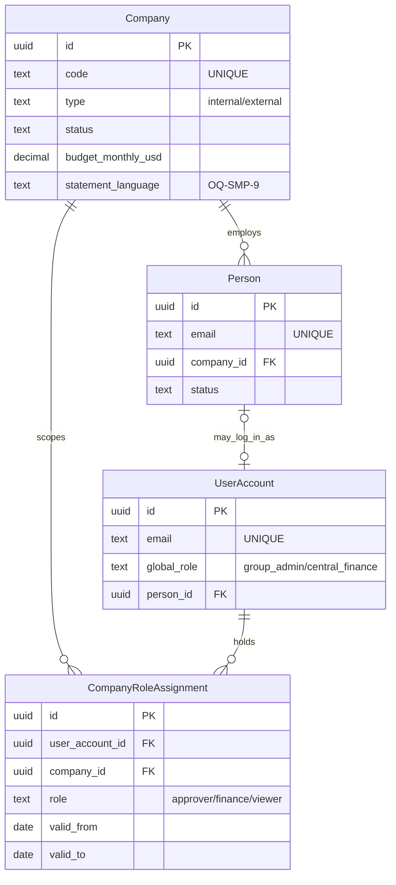
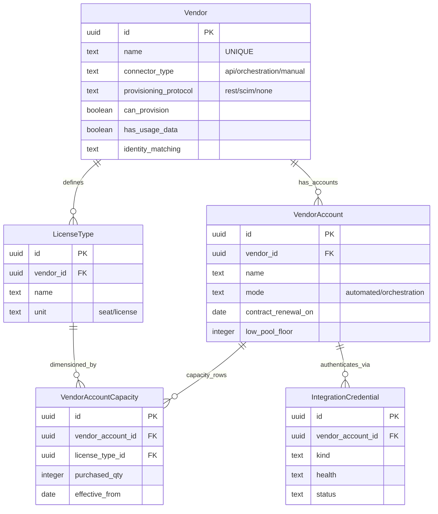
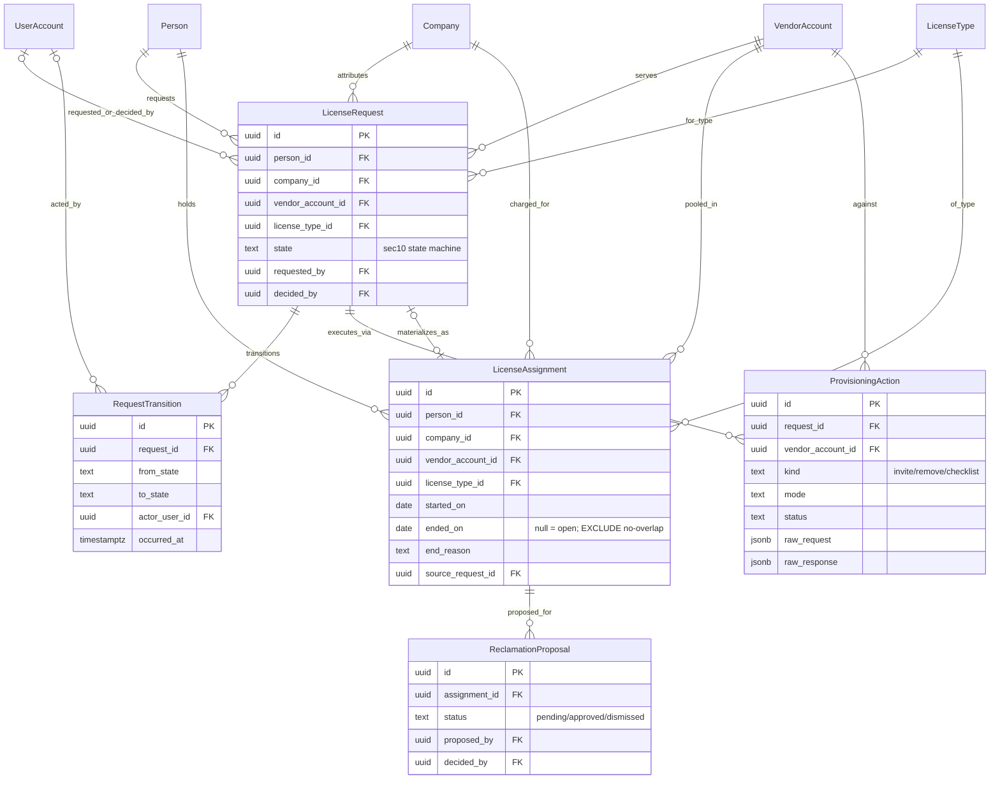
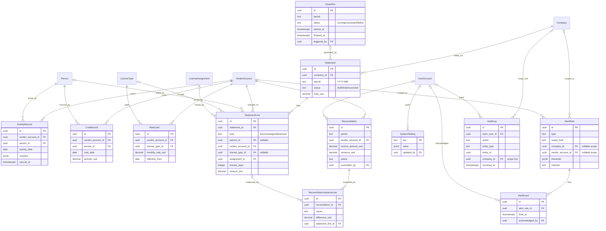
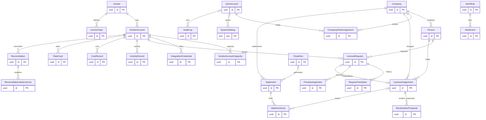

# 04 — ER Model: Ledger (`fcostudios__smp`)

**Step:** 4 — ER Model · **Date:** 2026-07-22 · **Report language:** en-US
**PRIOR_WORK:** `PRD.md` §14 (vendor-neutral core, 18 entities) · `v1/03_cx_journeys.md` SEC12 (early data view, CRUD by stage) · `v1/02_cx_personas.md` (roles/access) · `v1/01_research.md` (SCIM finding → connector protocol field) · DEC-SMP-002/004/006/008/009 · OQ-SMP-9/11
**Tech context:** PostgreSQL, Drizzle ORM (DEC-SMP-002); singular PascalCase entities, snake_case attributes; USD only (PRD A5).

---SECTION: SEC0---

## ER Model Executive Summary

Ledger's model is the **vendor-neutral license lifecycle core** (DEC-SMP-008): every vendor — Claude today, Microsoft 365 / OpenAI (SCIM) / SAP B1 later — maps onto the same spine: `Vendor → VendorAccount → LicenseType`, requests flow through `LicenseRequest` (the §10 state machine), and every held seat is a `LicenseAssignment` row in the append-only **register**, the chargeback source of truth (DEC-SMP-009). Money derives from the register: effective-dated `RateCard` × register seat-days → `Statement`/`StatementLine`, reconciled per period in `Reconciliation`.

Eight data domains: **org registry** (Company, Person + platform identity), **vendor catalog** (vendors, accounts, license types, credentials), **request workflow**, **register** (assignments + provisioning actions), **telemetry** (activity/cost sync), **billing**, **alerts**, **audit**. Cross-cutting concerns: company-scoping on every company-owned row (`company_id`, the PRD §15 highest-severity bug class), DB-level register integrity (no overlapping assignments — Postgres exclusion constraint), append-only audit (no UPDATE/DELETE grants), raw vendor payloads stored beside parsed rows for replay (PRD §13).

22 persistent entities: the 18 from PRD §14 plus 4 `[DERIVED_ENTITY]` normalizations (UserAccount, CompanyRoleAssignment, VendorAccountCapacity, RequestTransition) required for RBAC, per-org capacity, and transition history.

---SECTION: SEC1---

## Inputs Synthesis & Modeling Scope

- `[SRC:RAW]` PRD §14 enumerates the 18-entity vendor-neutral core with key fields; §8/§13 fix hard constraints (raw payload storage, rate limits, beta headers centralized); §15 demands DB-level register integrity + append-only audit; Module H defines 5 roles.
- `[SRC:PER]` 6 personas map to roles and scopes: Group Admin (all), Company Approver/Finance/Viewer (one company), Central Finance (all statements), End User (own requests). MSP (R3+) shapes isolation only.
- `[SRC:CJ]` SEC12 CRUD matrix anchors create/update points per journey stage (J1 S1..S5, J2, J3, J4); the register is written at activation (TB_S4_2) and closed at offboarding; statements at TB_J3_1; reconciliation at TB_J3_2.
- `[SRC:LEGACY]` None — greenfield (no legacy model; SEC5 short).

**In scope:** all R1 modules (A–H) + the Module I design rules that shape the schema now (connector capability fields, license-type dimension). **Out of scope:** MSP markup/isolation columns (🔴, additive later), Slack/Teams channel configs (🟡 R2, lives in AlertRule.channel enum growth), IdP/SCIM outbound provisioning (🔴), BI marts.

**Assumptions:**
- `[ASSUMPTION]` A-ER-1: `uuid` (v7) surrogate PKs everywhere; natural keys enforced via UNIQUE.
- `[ASSUMPTION]` A-ER-2: USD-only per PRD A5 — no currency table/column; if a non-USD company appears, add `currency_code` + manual monthly rate (contained change, per PRD).
- `[ASSUMPTION]` A-ER-3: platform users are modeled separately from `Person` (a seat-holder need not log in to Ledger; an approver need not hold a seat). `UserAccount.person_id` links when both apply.
- `[ASSUMPTION]` A-ER-4: register granularity is date-based (`started_on`/`ended_on` dates, inclusive) — seat-days are the billing quantum (PRD Module E: "seat-days × rate"; proration daily actual/actual).
- `[ASSUMPTION]` A-ER-5: request state timestamps live in `RequestTransition` (one row per §10 transition) rather than 10 nullable timestamp columns; current state denormalized on `LicenseRequest.state`.

---SECTION: SEC2---

## Domain Decomposition & High-Level Entity Map

| Domain | Entity | Brief business description | Source(s) |
|---|---|---|---|
| org_registry_context | Company | Managed company; scoping + attribution target | [SRC:RAW] |
| org_registry_context | Person | Employee; seat subject; one company at a time (history via register) | [SRC:RAW] |
| org_registry_context | UserAccount | Platform login (email+password+2FA), global role | [DERIVED_ENTITY] (Module H) |
| org_registry_context | CompanyRoleAssignment | User ↔ company scoped role (approver/finance/viewer) | [DERIVED_ENTITY] (Module A approver_ids normalized) |
| vendor_catalog_context | Vendor | Anthropic, Microsoft, OpenAI, SAP…; connector type + protocol | [SRC:RAW] |
| vendor_catalog_context | VendorAccount | One vendor org/tenant (D1 Anthropic orgs); mode flag; renewal | [SRC:RAW] |
| vendor_catalog_context | VendorAccountCapacity | Purchased quantity per (account, license type) | [DERIVED_ENTITY] ("capacity by license_type") |
| vendor_catalog_context | LicenseType | Seat/SKU dimension per vendor | [SRC:RAW] |
| vendor_catalog_context | IntegrationCredential | Encrypted scoped keys per account; health state | [SRC:RAW] |
| request_workflow_context | LicenseRequest | §10 state-machine object; approver decision | [SRC:RAW] |
| request_workflow_context | RequestTransition | One row per state transition (who/when/note) | [DERIVED_ENTITY] ("timestamps per transition") |
| register_context | LicenseAssignment | THE register: person/company/account/type, start/end/reason | [SRC:RAW] |
| register_context | ProvisioningAction | Invite/remove/checklist execution + raw payloads | [SRC:RAW] |
| telemetry_context | ActivityRecord | Person-day activity per account (schema-flexible counters) | [SRC:RAW] |
| telemetry_context | CostRecord | Per-user usage cost where vendor provides it | [SRC:RAW] |
| billing_context | RateCard | Effective-dated monthly rate per (account, license type) | [SRC:RAW] |
| billing_context | Statement | Per-company monthly statement (draft/final/reconciled) | [SRC:RAW] |
| billing_context | StatementLine | Statement detail line (license/usage/adjustment) | [SRC:RAW] |
| billing_context | Reconciliation | Period rollup vs vendor invoice; variance; override | [SRC:RAW] |
| alerts_context | AlertRule | Alert type/scope/threshold/channel config | [SRC:RAW] |
| alerts_context | AlertEvent | Fired alert; notified; acknowledged | [SRC:RAW] |
| audit_context | AuditLog | Append-only actor/action/entity/before/after | [SRC:RAW] |

---SECTION: SEC3---

## Detailed Entity Catalogue

### `Company`

- **Domain:** `org_registry_context`
- **Business purpose.** One of the ~30 managed companies — the attribution and scoping unit. Statement recipient; budget holder. `[SRC:RAW]` Module A.
- **Lifecycle.** Seeded via CSV import at Sprint 0; created/edited by Group Admin; soft-deactivated via `status` (never deleted — register history depends on it). `[SRC:CJ]`
- **Flags.** `requires_versioning: no` · `has_soft_delete: via status` · `audit_required: yes` · `multi_tenant_scoped: is the scope root`

| Attribute | Type | PK/FK/IDX | Nullable | Description | Example | Source(s) |
|---|---|---|---|---|---|---|
| `id` | `uuid` (v7) | PK | no |  |  | A-ER-1 |
| `name` | `text` |  | no |  | `Right Angle Media` | [SRC:RAW] |
| `code` | `text` | UNIQUE(code) | no | Short code used on statements | `RAM` | [SRC:RAW] |
| `type` | `text` (enum) |  | no | `internal / external` | `internal` | [SRC:RAW] |
| `status` | `text` (enum) |  | no | `active / inactive` | `active` | [SRC:RAW] |
| `budget_monthly_usd` | `decimal(10,2)` |  | yes | Monthly Claude budget (soft-check input) | `1500.00` | [SRC:RAW] |
| `finance_contact_email` | `text` |  | yes | Statement recipient | … | [SRC:RAW] |
| `statement_language` | `text` (enum) |  | yes | `es / en` | `es` | [SRC:CJ] |
| `created_at` | `timestamptz` |  | no |  |  | — |
| `created_by` | `uuid` | FK => UserAccount.id | no |  |  | — |
| `updated_at` | `timestamptz` |  | yes |  |  | — |
| `updated_by` | `uuid` | FK => UserAccount.id | yes |  |  | — |

> Enum notes: `statement_language` is the per-company statement language, default pending [OPEN_QUESTION OQ-SMP-9].
> Designated approvers are NOT a column: normalized into `CompanyRoleAssignment` rows (role `approver`) — see that entity. [DERIVED_ENTITY] rationale: PRD lists `approver_ids` plural; a join row carries who/when/by-whom.

### `Person`

- **Domain:** `org_registry_context`
- **Business purpose.** An employee who holds (or requests) licenses. Belongs to exactly one company at a time; historical membership is reconstructed from the register, not duplicated here. `[SRC:RAW]` Module A.
- **Lifecycle.** Created by a seat request if absent (J1 S1) or bulk import (🟡); company moves update `company_id` and close/open register rows (J2→J1). `[SRC:CJ]`
- **Flags.** `requires_versioning: no` · `has_soft_delete: via status` · `audit_required: yes` · `multi_tenant_scoped: yes`

| Attribute | Type | PK/FK/IDX | Nullable | Description | Example | Source(s) |
|---|---|---|---|---|---|---|
| `id` | `uuid` (v7) | PK | no |  |  | A-ER-1 |
| `email` | `text` | UNIQUE(email) | no | Corporate email; vendor identity match key | … | [SRC:RAW] |
| `full_name` | `text` |  | no |  |  | [SRC:RAW] |
| `company_id` | `uuid` | FK => Company.id, IDX | no | Current company (exactly one) | … | [SRC:RAW] |
| `status` | `text` (enum) |  | no | `active / departed` | `active` | [SRC:RAW] |
| `created_at` | `timestamptz` |  | no |  |  | — |
| `created_by` | `uuid` | FK => UserAccount.id | no |  |  | — |
| `updated_at` | `timestamptz` |  | yes |  |  | — |
| `updated_by` | `uuid` | FK => UserAccount.id | yes |  |  | — |

### `UserAccount`

- **Domain:** `org_registry_context` **[DERIVED_ENTITY]**
- **Business purpose.** A platform login for Ledger itself (Module H): email + strong password + mandatory 2FA for admin roles. Distinct from `Person` (A-ER-3). Global roles here; company-scoped roles in `CompanyRoleAssignment`.
- **Lifecycle.** Created by Group Admin; deactivated on departure; SSO (OIDC) replaces password auth in 🟡 R2 without schema change (add `idp_subject`).
- **Flags.** `requires_versioning: no` · `has_soft_delete: via status` · `audit_required: yes` · `multi_tenant_scoped: no (global table; scoping via roles)`
- **Enum notes.** `global_role` null means the user holds only company-scoped roles (CompanyRoleAssignment). `ui_language` null falls back to SystemSetting `default_language` (per-user selector, DEC-SMP-004/011).

| Attribute | Type | PK/FK/IDX | Nullable | Description | Example | Source(s) |
|---|---|---|---|---|---|---|
| `id` | `uuid` (v7) | PK | no |  |  | A-ER-1 |
| `email` | `text` | UNIQUE(email) | no | Login identifier | … | [SRC:RAW] Module H |
| `idp_subject` | `text` | UNIQUE(idp_subject) | yes | Keycloak OIDC subject (ADR-03/DEC-SMP-014); null until first login | … | [SRC:RAW] ADR-03 |
| `password_hash` | `text` |  | yes | UNUSED under Keycloak (ADR-03) — break-glass local profile only, disabled by default | … | [SRC:RAW] Module H |
| `totp_secret_encrypted` | `text` |  | yes | UNUSED under Keycloak — TOTP enforced by realm policy (ADR-03); retained for break-glass profile | … | [SRC:RAW] Module H |
| `global_role` | `text` (enum) |  | yes | `group_admin / central_finance` | `group_admin` | [SRC:RAW] Module H |
| `person_id` | `uuid` | FK => Person.id, UNIQUE(person_id) | yes | Link when the user is also a seat-holder (0..1 — NULLs distinct) | … | A-ER-3 |
| `ui_language` | `text` (enum) |  | yes | `es / en` | `es` | [SRC:CJ] |
| `status` | `text` (enum) |  | no | `active / disabled` | `active` | — |
| `last_login_at` | `timestamptz` |  | yes | Login events also audit-logged | … | [SRC:RAW] Module H |
| `created_at` | `timestamptz` |  | no |  |  | — |
| `created_by` | `uuid` | FK => UserAccount.id | yes | Null for bootstrap admin | … | — |

### `CompanyRoleAssignment`

- **Domain:** `org_registry_context` **[DERIVED_ENTITY]**
- **Business purpose.** Grants a `UserAccount` a role scoped to one `Company`: approver / finance / viewer (Module H roles minus the two global ones). Normalizes PRD Module A's `approver_ids`. Server-side scoping reads this table.
- **Lifecycle.** Created by Group Admin (per OQ-SMP-5 roster); delegation (🟡) adds time-boxed rows (`valid_from`/`valid_to`).
- **Flags.** `requires_versioning: no` · `has_soft_delete: hard delete allowed (grants), audit-logged` · `audit_required: yes` · `multi_tenant_scoped: yes`

| Attribute | Type | PK/FK/IDX | Nullable | Description | Example | Source(s) |
|---|---|---|---|---|---|---|
| `id` | `uuid` (v7) | PK | no |  |  | A-ER-1 |
| `user_account_id` | `uuid` | FK => UserAccount.id, IDX | no |  |  | [SRC:RAW] Module H |
| `company_id` | `uuid` | FK => Company.id, IDX | no |  |  | [SRC:RAW] Module A |
| `role` | `text` (enum) |  | no | `approver / finance / viewer` | `approver` | [SRC:RAW] Module H |
| `valid_from` | `date` |  | yes | For delegation windows (R2) | … | [SRC:RAW] Module B P1 |
| `valid_to` | `date` |  | yes |  |  | [SRC:RAW] Module B P1 |
| `unique_grant` | `text` | UNIQUE(user_account_id, company_id, role) | no | One grant per triple [ASSUMPTION] | … | A-ER-1 |
| `created_at` | `timestamptz` |  | no |  |  | — |
| `created_by` | `uuid` | FK => UserAccount.id | no |  |  | — |

### `Vendor`

- **Domain:** `vendor_catalog_context`
- **Business purpose.** A SaaS vendor under management (Anthropic, Microsoft, OpenAI, SAP…). Carries the connector's **capability descriptor** (Module I): what automates, what runs in orchestration mode, and — per the Step-1 SCIM finding — the provisioning protocol.
- **Lifecycle.** Seeded with Anthropic (connector #1); new vendors via manual registry (🟡).
- **Flags.** `requires_versioning: no` · `has_soft_delete: via status` · `audit_required: yes` · `multi_tenant_scoped: no (global catalog)`

| Attribute | Type | PK/FK/IDX | Nullable | Description | Example | Source(s) |
|---|---|---|---|---|---|---|
| `id` | `uuid` (v7) | PK | no |  |  | A-ER-1 |
| `name` | `text` | UNIQUE(name) | no |  | `Anthropic` | [SRC:RAW] |
| `category` | `text` |  | yes |  | `llm_provider` | [SRC:RAW] |
| `connector_type` | `text` (enum) |  | no | `api / orchestration / manual` | `api` | [SRC:RAW] |
| `provisioning_protocol` | `text` (enum) |  | no | `rest / scim / none` | `rest` | [SRC:RAW] 01_research §6.2 |
| `can_provision` | `boolean` |  | no | Capability descriptor | `true` | [SRC:RAW] Module I |
| `can_deprovision` | `boolean` |  | no |  | `true` | [SRC:RAW] Module I |
| `has_usage_data` | `boolean` |  | no |  | `true` | [SRC:RAW] Module I |
| `has_cost_data` | `boolean` |  | no |  | `true` | [SRC:RAW] Module I |
| `identity_matching` | `text` (enum) |  | no | `email / upn / vendor_user_id` | `email` | [SRC:RAW] Module I |
| `status` | `text` (enum) |  | no | `active / inactive` | `active` | — |
| `created_at` | `timestamptz` |  | no |  |  | — |
| `created_by` | `uuid` | FK => UserAccount.id | no |  |  | — |

### `VendorAccount`

- **Domain:** `vendor_catalog_context`
- **Business purpose.** One vendor org/tenant/license-server: the D1 Anthropic orgs (central + carve-outs), later one M365 tenant per company, a SAP B1 license server. The unit of pools, credentials, sync jobs, and execution mode (DEC-SMP-006/007). `[SRC:RAW]` §9, §14.
- **Lifecycle.** Created at onboarding per org inventory (OQ-SMP-1); mode flipped between automated/orchestration per org (Module C); ingestion_mode flipped between api/csv_import/manual per org (DEC-SMP-018).
- **Flags.** `requires_versioning: no` · `has_soft_delete: via status` · `audit_required: yes` · `multi_tenant_scoped: no (an account can serve many companies)`

| Attribute | Type | PK/FK/IDX | Nullable | Description | Example | Source(s) |
|---|---|---|---|---|---|---|
| `id` | `uuid` (v7) | PK | no |  |  | A-ER-1 |
| `vendor_id` | `uuid` | FK => Vendor.id, IDX | no |  |  | [SRC:RAW] |
| `name` | `text` | UNIQUE(vendor_id, name) | no |  | `Central Claude Enterprise org` | [SRC:RAW] |
| `mode` | `text` (enum) |  | no | `automated / orchestration` | `automated` | [SRC:RAW] §13 |
| `ingestion_mode` | `text` (enum) |  | no | `api / csv_import / manual` — how member/activity/cost data enters for this org (DEC-SMP-018). Orgs without API access (e.g. a Claude Teams plan) run on Console CSV exports or manual upkeep; independent of provisioning `mode` | `api` | DEC-SMP-018 |
| `vendor_org_ref` | `text` |  | yes | Vendor-side org identifier | … | [ASSUMPTION] |
| `contract_renewal_on` | `date` |  | yes | Renewal alerts (🟡) | `2027-01-01` | [SRC:RAW] |
| `low_pool_floor` | `integer` |  | no | Low-pool alert threshold, default 5 | `5` | [SRC:RAW] Module C |
| `status` | `text` (enum) |  | no | `active / inactive` | `active` | — |
| `created_at` | `timestamptz` |  | no |  |  | — |
| `created_by` | `uuid` | FK => UserAccount.id | no |  |  | — |
| `updated_at` | `timestamptz` |  | yes |  |  | — |
| `updated_by` | `uuid` | FK => UserAccount.id | yes |  |  | — |

### `VendorAccountCapacity`

- **Domain:** `vendor_catalog_context` **[DERIVED_ENTITY]**
- **Business purpose.** Purchased quantity per (vendor account, license type) — PRD §14's "capacity by license_type" normalized. Free seats = capacity − open assignments − pending invites (derived, never stored). Updated from contracts on purchases (runbook step).
- **Lifecycle.** Row per capacity change (effective-dated) so purchase history is auditable; latest row wins.
- **Flags.** `requires_versioning: effective-dated by design` · `has_soft_delete: no` · `audit_required: yes` · `multi_tenant_scoped: no`

| Attribute | Type | PK/FK/IDX | Nullable | Description | Example | Source(s) |
|---|---|---|---|---|---|---|
| `id` | `uuid` (v7) | PK | no |  |  | A-ER-1 |
| `vendor_account_id` | `uuid` | FK => VendorAccount.id, IDX | no |  |  | [SRC:RAW] |
| `license_type_id` | `uuid` | FK => LicenseType.id | no |  |  | [SRC:RAW] |
| `purchased_qty` | `integer` |  | no | Total purchased as of effective date | `120` | [SRC:RAW] Module C |
| `effective_from` | `date` | UNIQUE(vendor_account_id, license_type_id, effective_from) | no |  | `2026-08-01` | [ASSUMPTION] |
| `note` | `text` |  | yes | Purchase reference (prorated addition, renewal cut) | … | [SRC:RAW] §8 |
| `created_at` | `timestamptz` |  | no |  |  | — |
| `created_by` | `uuid` | FK => UserAccount.id | no |  |  | — |

### `LicenseType`

- **Domain:** `vendor_catalog_context`
- **Business purpose.** The seat/SKU/license-type dimension per vendor (Claude Enterprise seat; M365 E3/E5; SAP B1 Professional/Limited/Indirect) so chargeback math is uniform across vendors (Module I).
- **Lifecycle.** Seeded per vendor; grows with the registry (🟡).
- **Flags.** `requires_versioning: no` · `has_soft_delete: via status` · `audit_required: yes` · `multi_tenant_scoped: no`

| Attribute | Type | PK/FK/IDX | Nullable | Description | Example | Source(s) |
|---|---|---|---|---|---|---|
| `id` | `uuid` (v7) | PK | no |  |  | A-ER-1 |
| `vendor_id` | `uuid` | FK => Vendor.id, IDX | no |  |  | [SRC:RAW] |
| `name` | `text` | UNIQUE(vendor_id, name) | no |  | `Enterprise seat` | [SRC:RAW] |
| `unit` | `text` (enum) |  | no | `seat / license` | `seat` | [SRC:RAW] |
| `status` | `text` (enum) |  | no | `active / inactive` | `active` | — |
| `created_at` | `timestamptz` |  | no |  |  | — |
| `created_by` | `uuid` | FK => UserAccount.id | no |  |  | — |

### `IntegrationCredential`

- **Domain:** `vendor_catalog_context`
- **Business purpose.** An encrypted vendor API credential scoped to one `VendorAccount`: Anthropic scoped Admin key (`read:members`,`write:members`), Analytics key, later Graph app registration or SCIM bearer. Health-checked; masked in UI (last 4); rotated without downtime (Module H).
- **Lifecycle.** Created per org at Sprint 0 (primary-owner action, OQ-SMP-1); rotation creates a new row and retires the old (`status`), preserving audit. `health` distinguishes auth failure from genuinely empty data (Module D).
- **Flags.** `requires_versioning: rotation-by-new-row` · `has_soft_delete: via status` · `audit_required: yes` · `multi_tenant_scoped: no`

| Attribute | Type | PK/FK/IDX | Nullable | Description | Example | Source(s) |
|---|---|---|---|---|---|---|
| `id` | `uuid` (v7) | PK | no |  |  | A-ER-1 |
| `vendor_account_id` | `uuid` | FK => VendorAccount.id, IDX | no |  |  | [SRC:RAW] |
| `kind` | `text` (enum) |  | no | `admin_scoped / analytics / graph_app / scim_bearer` | `admin_scoped` | [SRC:RAW] §14 + 01_research |
| `encrypted_secret` | `text` |  | no | Envelope-encrypted at rest | … | [SRC:RAW] Module H |
| `scopes` | `text` |  | yes | Declared scopes | `read:members write:members` | [SRC:RAW] Module H |
| `last4` | `text` |  | yes | UI masking | `…a9f2` | [SRC:RAW] Module H |
| `last_verified_at` | `timestamptz` |  | yes | Credential health check (J4) | … | [SRC:RAW] |
| `health` | `text` (enum) |  | no | `ok / auth_failed / unverified` | `ok` | [SRC:RAW] Module D |
| `status` | `text` (enum) |  | no | `active / retired` | `active` | — |
| `created_at` | `timestamptz` |  | no |  |  | — |
| `created_by` | `uuid` | FK => UserAccount.id | no |  |  | — |

### `LicenseRequest`

- **Domain:** `request_workflow_context`
- **Business purpose.** The J1 workflow object: one request for one person to hold one license type on one vendor account, moving through the §10 state machine with a recorded approver decision. `[SRC:RAW]` §14, Module B.
- **Lifecycle.** Created at S1 (creates `Person` if absent); validated → Pending Approval; decided at S2; provisioned S3/S4; provisioning API error → `failed` (fires `provisioning_failure` AlertRule; retry returns to `provisioning`) per §10 "→ Failed with alert on API error"; terminal states Deprovisioned/Rejected. Transitions in `RequestTransition`. **System-materialized rows:** the go-live import backfill (SEC5) and each reconciliation drift-claim (J4 claim task) create one LicenseRequest per seat directly in `state='active'` — `justification` = `'importación inicial'` / `'reclamo por deriva'`, `requested_by`/`decided_by`/`created_by` NULL (system), with one `RequestTransition` (`from_state` NULL → `active`, `actor_user_id` NULL). Every register row therefore has a request anchor, so J2 (`flagged_inactive`→`offboarding`→`deprovisioned`) and `ProvisioningAction.request_id` work identically for request-, import- and reconciliation-sourced seats. `[SRC:CJ]`
- **Flags.** `requires_versioning: transitions table` · `has_soft_delete: no (terminal states)` · `audit_required: yes` · `multi_tenant_scoped: yes`

| Attribute | Type | PK/FK/IDX | Nullable | Description | Example | Source(s) |
|---|---|---|---|---|---|---|
| `id` | `uuid` (v7) | PK | no |  |  | A-ER-1 |
| `request_no` | `text` | UNIQUE(request_no) | no | Sequence-generated human code (`SOL-NNNN`) shown in register traceability, links and emails | `SOL-1042` | [SRC:CJ] |
| `person_id` | `uuid` | FK => Person.id, IDX | no |  |  | [SRC:RAW] |
| `company_id` | `uuid` | FK => Company.id, IDX | no | Attribution at request time | … | [SRC:RAW] |
| `vendor_account_id` | `uuid` | FK => VendorAccount.id, IDX | no | Which org/pool serves it (D1) | … | [SRC:RAW] |
| `license_type_id` | `uuid` | FK => LicenseType.id | no |  |  | [SRC:RAW] |
| `state` | `text` (enum) | IDX | no | `submitted / pending_approval / approved / blocked_no_seat / provisioning / failed / invited / active / flagged_inactive / offboarding / deprovisioned / rejected` | `pending_approval` | [SRC:RAW] §10 |
| `justification` | `text` |  | no |  |  | [SRC:RAW] Module B |
| `needed_by` | `date` |  | yes |  |  | [SRC:RAW] Module B |
| `requested_by` | `uuid` | FK => UserAccount.id | yes | Null when self-service by the person [ASSUMPTION] | … | [SRC:RAW] Module B |
| `decided_by` | `uuid` | FK => UserAccount.id | yes | Approver (or Group Admin override) | … | [SRC:RAW] §10 |
| `decided_at` | `timestamptz` |  | yes |  |  | [SRC:RAW] §10 |
| `decision_comment` | `text` |  | yes | Mandatory on reject (app rule BR) | … | [SRC:RAW] Module B |
| `created_at` | `timestamptz` |  | no |  |  | — |
| `created_by` | `uuid` | FK => UserAccount.id | yes | Null on self-service submission [ASSUMPTION] | … | — |
| `updated_at` | `timestamptz` |  | yes |  |  | — |

### `RequestTransition`

- **Domain:** `request_workflow_context` **[DERIVED_ENTITY]**
- **Business purpose.** One row per §10 state transition of a request — "timestamps per transition" (PRD §14) normalized; powers aging/escalation timers (24 h / 48 h) and SLA reporting (G1). Append-only.
- **Lifecycle.** Written by the workflow engine at every transition; never updated or deleted.
- **Flags.** `requires_versioning: is the version log` · `has_soft_delete: no` · `audit_required: yes (also mirrored to AuditLog)` · `multi_tenant_scoped: yes (via request)`

| Attribute | Type | PK/FK/IDX | Nullable | Description | Example | Source(s) |
|---|---|---|---|---|---|---|
| `id` | `uuid` (v7) | PK | no |  |  | A-ER-1 |
| `request_id` | `uuid` | FK => LicenseRequest.id, IDX | no |  |  | [SRC:RAW] |
| `from_state` | `text` |  | yes | Null for creation | `approved` | [SRC:RAW] §10 |
| `to_state` | `text` |  | no |  | `provisioning` | [SRC:RAW] §10 |
| `actor_user_id` | `uuid` | FK => UserAccount.id | yes | Null for system/job transitions | … | [SRC:CJ] |
| `note` | `text` |  | yes | e.g. escalation reason, checklist ref | … | [SRC:RAW] Module B |
| `occurred_at` | `timestamptz` | IDX | no |  |  | [SRC:RAW] §14 |

### `LicenseAssignment`

- **Domain:** `register_context`
- **Business purpose.** **The register** — one row per continuous holding of one license by one person, attributed to exactly one company: the chargeback source of truth across ALL vendors (DEC-SMP-009). Append-only time series; the only in-place update is closing the open row (`ended_on`, `end_reason`).
- **Lifecycle.** Opened at activation (TB_S4_2) or reconciliation-claim (drift); closed at offboarding/transfer/reallocation (J2). PRD §10's `rejected-invite-expired` close reason is deliberately omitted from `end_reason`: an expired/withdrawn invite never reaches activation, so no register row exists to close — expired-invite terminations live on the request side only (`RequestTransition` to `deprovisioned` + `ProvisioningAction` `kind=withdraw_invite`, `status=withdrawn`). **DB-level integrity:** Postgres exclusion constraint forbids overlapping date ranges per (person, vendor account, license type); transfer contiguity enforced by a deferred constraint trigger in the same migration (re-verified at close, Step 9b). `[SRC:RAW]` Module E, §15.
- **Flags.** `requires_versioning: append-only by design` · `has_soft_delete: no` · `audit_required: yes` · `multi_tenant_scoped: yes`

| Attribute | Type | PK/FK/IDX | Nullable | Description | Example | Source(s) |
|---|---|---|---|---|---|---|
| `id` | `uuid` (v7) | PK | no |  |  | A-ER-1 |
| `person_id` | `uuid` | FK => Person.id, IDX | no |  |  | [SRC:RAW] |
| `company_id` | `uuid` | FK => Company.id, IDX | no | Attribution target — exactly one per row | … | [SRC:RAW] Module E |
| `vendor_account_id` | `uuid` | FK => VendorAccount.id, IDX | no | Seat lives in this org's pool | … | [SRC:RAW] §9 |
| `license_type_id` | `uuid` | FK => LicenseType.id | no |  |  | [SRC:RAW] |
| `started_on` | `date` | IDX | no | Inclusive (A-ER-4) | `2026-08-03` | [SRC:RAW] |
| `ended_on` | `date` |  | yes | Inclusive; null = open holding | `2026-09-09` | [SRC:RAW] |
| `end_reason` | `text` (enum) |  | yes | `left_company / inactive / reallocated` | `reallocated` | [SRC:RAW] §10 |
| `source_request_id` | `uuid` | FK => LicenseRequest.id, UNIQUE(source_request_id) | yes | Import/reconciliation rows reference their system-materialized request (see LicenseRequest lifecycle); null only for transfer-reopened rows (a transfer's inbound leg is its own fast-tracked request, PRD §10); Postgres NULLs-distinct makes plain UNIQUE enforce the 1:0..1 | … | [SRC:RAW] §14 |
| `source_kind` | `text` (enum) |  | no | `request / import / reconciliation / manual` — `manual` = admin-recorded row on an API-less org (DEC-SMP-018), same integrity constraints | `request` | [SRC:RAW] §14 |
| `note` | `text` |  | yes | Rationale for import/reconciliation rows (e.g. drift-claim comment), visible on the register row expander | … | [SRC:CJ] J4 |
| `created_at` | `timestamptz` |  | no |  |  | — |
| `created_by` | `uuid` | FK => UserAccount.id | yes | Null for job-written rows | … | — |

### `ProvisioningAction`

- **Domain:** `register_context`
- **Business purpose.** One vendor-side execution: invite, removal, SKU assign, invite withdrawal, or orchestration checklist — with the **raw request/response payloads** stored for audit and replay (PRD §13). Both execution modes write here identically (DEC-SMP-007).
- **Lifecycle.** Created by the engine at S3/J2; status advances on poll/confirmation; orchestration rows carry the checklist and the admin's confirmation, then sync verification ("verification failed" flag).
- **Flags.** `requires_versioning: no (status transitions audit-logged)` · `has_soft_delete: no` · `audit_required: yes` · `multi_tenant_scoped: yes (via request)`

| Attribute | Type | PK/FK/IDX | Nullable | Description | Example | Source(s) |
|---|---|---|---|---|---|---|
| `id` | `uuid` (v7) | PK | no |  |  | A-ER-1 |
| `request_id` | `uuid` | FK => LicenseRequest.id, IDX | no |  |  | [SRC:RAW] |
| `vendor_account_id` | `uuid` | FK => VendorAccount.id, IDX | no |  |  | [SRC:RAW] |
| `kind` | `text` (enum) |  | no | `invite / remove / assign_sku / withdraw_invite / checklist` | `invite` | [SRC:RAW] §14 |
| `mode` | `text` (enum) |  | no | `automated / orchestration` | `automated` | [SRC:RAW] Module C |
| `vendor_ref` | `text` |  | yes | anthropic_invite_id / graph request id / checklist id | … | [SRC:RAW] §14 |
| `status` | `text` (enum) |  | no | `pending / sent / confirmed / failed / verification_failed / withdrawn` | `confirmed` | [SRC:RAW] Module C |
| `failure_reason` | `text` |  | yes | Human-readable reason set when `status` transitions to `failed` (mapped from the provider error in `raw_response`) or `verification_failed` (sync verification has no provider payload — DEC-SMP-007); localized es-EC; raw payloads remain the forensic source | … | [SRC:CJ] J4 |
| `raw_request` | `jsonb` |  | yes | Full API request payload | … | [SRC:RAW] §13 |
| `raw_response` | `jsonb` |  | yes | Full API response payload | … | [SRC:RAW] §13 |
| `sent_at` | `timestamptz` |  | yes |  |  | [SRC:RAW] §14 |
| `resolved_at` | `timestamptz` |  | yes |  |  | [SRC:RAW] §14 |
| `created_at` | `timestamptz` |  | no |  |  | — |

### `ReclamationProposal`

- **Domain:** `register_context` **[DERIVED_ENTITY]**
- **Business purpose.** A persisted reclamation proposal (J2): the Group Admin (or the inactivity job) proposes freeing a specific assignment; the company approver approves ("Liberar") or dismisses ("Mantener", mandatory note). Powers SCR-reclamation-proposals' pending queue; a dismissal suppresses re-proposal for that assignment until a new inactivity window elapses. `[SRC:CJ]` J2 ("Reclamation proposal, never silent removal").
- **Lifecycle.** Created `pending` from SCR-usage/SCR-pools; approved → drives the offboarding flow (ProvisioningAction removal + LicenseRequest transition via the assignment's anchor request); dismissed → recorded with `decision_note`. One open proposal per assignment (partial UNIQUE).
- **Flags.** `requires_versioning: no` · `has_soft_delete: no (terminal statuses)` · `audit_required: yes` · `multi_tenant_scoped: yes (via assignment)`

| Attribute | Type | PK/FK/IDX | Nullable | Description | Example | Source(s) |
|---|---|---|---|---|---|---|
| `id` | `uuid` (v7) | PK | no |  |  | A-ER-1 |
| `assignment_id` | `uuid` | FK => LicenseAssignment.id, IDX | no | UNIQUE among status=pending (partial index; raw SQL migration) | … | [SRC:CJ] J2 |
| `proposed_by` | `uuid` | FK => UserAccount.id | yes | Null when the inactivity job proposes | … | [SRC:CJ] J2 |
| `proposal_note` | `text` |  | yes | Admin's note to the approver | … | [SRC:CJ] J2 |
| `status` | `text` (enum) |  | no | `pending / approved / dismissed` | `pending` | [SRC:CJ] J2 |
| `decided_by` | `uuid` | FK => UserAccount.id | yes |  |  | [SRC:CJ] J2 |
| `decided_at` | `timestamptz` |  | yes |  |  | [SRC:CJ] J2 |
| `decision_note` | `text` |  | yes | Mandatory (app-level) when dismissed | … | [SRC:CJ] J2 |
| `created_at` | `timestamptz` |  | no |  |  | — |

### `ActivityRecord`

- **Domain:** `telemetry_context`
- **Business purpose.** Person-day activity grain per vendor account (chat messages, Claude Code sessions, Cowork), schema-flexible counters + raw payload — feeds inactivity flags (30/60/90d) and utilization views. ~3-day lag; freshness surfaced in UI. `[SRC:RAW]` Module D, §8.
- **Lifecycle.** Upserted by the daily analytics sync job, a Console CSV usage import, or manual entry per the org's ingestion_mode (DEC-SMP-018) — all channels idempotent on the (org, person, date) key with `source` provenance.
- **Flags.** `requires_versioning: no` · `has_soft_delete: no` · `audit_required: sync-job level` · `multi_tenant_scoped: via person`

| Attribute | Type | PK/FK/IDX | Nullable | Description | Example | Source(s) |
|---|---|---|---|---|---|---|
| `id` | `uuid` (v7) | PK | no |  |  | A-ER-1 |
| `vendor_account_id` | `uuid` | FK => VendorAccount.id, IDX | no |  |  | [SRC:RAW] |
| `person_id` | `uuid` | FK => Person.id, IDX | no | Matched via Vendor.identity_matching | … | [SRC:RAW] Module I |
| `activity_date` | `date` | UNIQUE(vendor_account_id, person_id, activity_date) | no |  | `2026-08-04` | [SRC:RAW] §14 |
| `counters` | `jsonb` |  | no | Schema-flexible activity counters | `{"chat":12,"code_sessions":3}` | [SRC:RAW] §14 |
| `source` | `text` (enum) |  | no | `api / csv_import / manual` — ingestion channel provenance (DEC-SMP-018); default `api` | `api` | DEC-SMP-018 |
| `raw_payload` | `jsonb` |  | yes | Vendor payload for replay (CSV imports store the parsed row) | … | [SRC:RAW] §13 |
| `synced_at` | `timestamptz` |  | no | Freshness labeling source (import/manual entries stamp it too) | … | [SRC:RAW] Module D |

### `CostRecord`

- **Domain:** `telemetry_context`
- **Business purpose.** Per-user/day metered cost where a vendor provides it (Anthropic Analytics cost endpoints on usage-based plans) — mapped through the register to a company at close (Module E "usage-based charges if any"). Amounts revisable by the vendor for 30 days → rows carry sync provenance.
- **Lifecycle.** Upserted by cost sync; re-synced values overwrite within the revision window (job-idempotent).
- **Flags.** `requires_versioning: no (revision window overwrites, sync audit-logged)` · `has_soft_delete: no` · `audit_required: sync-job level` · `multi_tenant_scoped: via person`

| Attribute | Type | PK/FK/IDX | Nullable | Description | Example | Source(s) |
|---|---|---|---|---|---|---|
| `id` | `uuid` (v7) | PK | no |  |  | A-ER-1 |
| `vendor_account_id` | `uuid` | FK => VendorAccount.id, IDX | no |  |  | [SRC:RAW] |
| `person_id` | `uuid` | FK => Person.id, IDX | no |  |  | [SRC:RAW] |
| `cost_date` | `date` | UNIQUE(vendor_account_id, person_id, cost_date) | no |  | `2026-08-04` | [SRC:RAW] §14 |
| `amount_usd` | `decimal(12,4)` |  | no | Vendor reports decimal-string cents; stored as USD decimal | `4.2150` | [SRC:RAW] §20 |
| `source` | `text` (enum) |  | no | `api / csv_import / manual` — ingestion channel provenance (DEC-SMP-018); default `api` | `api` | DEC-SMP-018 |
| `raw_payload` | `jsonb` |  | yes |  |  | [SRC:RAW] §13 |
| `synced_at` | `timestamptz` |  | no | Revisable ~30 days → last sync wins | … | [SRC:RAW] §8 |

### `RateCard`

- **Domain:** `billing_context`
- **Business purpose.** Contracted monthly rate per (vendor account, license type), **effective-dated** so renewals reprice cleanly; proration daily actual/actual (Module E). Values pending OQ-SMP-4.
- **Lifecycle.** Entered by Group Admin/Central Finance from contracts; new period = new row; never edited in place after a close has consumed it (BR, Step 9b).
- **Flags.** `requires_versioning: effective-dated by design` · `has_soft_delete: no` · `audit_required: yes` · `multi_tenant_scoped: no`

| Attribute | Type | PK/FK/IDX | Nullable | Description | Example | Source(s) |
|---|---|---|---|---|---|---|
| `id` | `uuid` (v7) | PK | no |  |  | A-ER-1 |
| `vendor_account_id` | `uuid` | FK => VendorAccount.id, IDX | no |  |  | [SRC:RAW] |
| `license_type_id` | `uuid` | FK => LicenseType.id | no |  |  | [SRC:RAW] |
| `monthly_rate_usd` | `decimal(10,2)` |  | no |  | `60.00` | [SRC:RAW] §14 |
| `effective_from` | `date` | UNIQUE(vendor_account_id, license_type_id, effective_from) | no |  | `2026-08-01` | [SRC:RAW] §14 |
| `effective_to` | `date` |  | yes | Null = current | … | [SRC:RAW] §14 |
| `created_at` | `timestamptz` |  | no |  |  | — |
| `created_by` | `uuid` | FK => UserAccount.id | no |  |  | — |

### `Statement`

- **Domain:** `billing_context`
- **Business purpose.** One company's monthly statement: opening seats, joiners/leavers, seat-days × rate, usage charges, total — a reconciliation-grade document (not a legal invoice). One per company-period covering all vendors. `[SRC:RAW]` Module E, §14.
- **Lifecycle.** Created by the close job (bd 3, TB_J3_1) as draft → final → reconciled (with its period's `Reconciliation`); regenerating a draft replaces lines; finals are immutable (BR, Step 9b).
- **Flags.** `requires_versioning: status-locked immutability` · `has_soft_delete: no` · `audit_required: yes` · `multi_tenant_scoped: yes`

| Attribute | Type | PK/FK/IDX | Nullable | Description | Example | Source(s) |
|---|---|---|---|---|---|---|
| `id` | `uuid` (v7) | PK | no |  |  | A-ER-1 |
| `company_id` | `uuid` | FK => Company.id, IDX | no |  |  | [SRC:RAW] |
| `period` | `text` | UNIQUE(company_id, period) | no | `YYYY-MM` | `2026-08` | [SRC:RAW] §14 |
| `status` | `text` (enum) |  | no | `draft / final / reconciled` | `final` | [SRC:RAW] §14 |
| `opening_seats` | `integer` |  | no |  | `14` | [SRC:RAW] Module E |
| `total_usd` | `decimal(12,2)` |  | no | Sum of lines (derived, stored at close) | `840.00` | [SRC:RAW] Module E |
| `generated_at` | `timestamptz` |  | no | Close-run stamp | … | [SRC:CJ] |
| `close_run_id` | `uuid` | FK => CloseRun.id, IDX | yes | Run that generated this statement (null pre-CloseRun rows) | … | [SRC:CJ] |
| `created_at` | `timestamptz` |  | no |  |  | — |

### `StatementLine`

- **Domain:** `billing_context`
- **Business purpose.** One charge line: person × vendor account × license type × license-days × rate (kind `license`), a metered `usage` charge, or a manual `adjustment` — every line traceable to register rows/raw payloads (PRD §15 Auditability).
- **Lifecycle.** Written by the close job; immutable once the statement is final; adjustments are new lines on the next draft, never edits.
- **Flags.** `requires_versioning: no (immutable with statement)` · `has_soft_delete: no` · `audit_required: yes` · `multi_tenant_scoped: yes (via statement)`

| Attribute | Type | PK/FK/IDX | Nullable | Description | Example | Source(s) |
|---|---|---|---|---|---|---|
| `id` | `uuid` (v7) | PK | no |  |  | A-ER-1 |
| `statement_id` | `uuid` | FK => Statement.id, IDX | no |  |  | [SRC:RAW] |
| `kind` | `text` (enum) |  | no | `license / usage / adjustment` | `license` | [SRC:RAW] §14 |
| `person_id` | `uuid` | FK => Person.id | yes | Null for account-level adjustments | … | [SRC:RAW] §14 |
| `vendor_account_id` | `uuid` | FK => VendorAccount.id | no |  |  | [SRC:RAW] §14 |
| `license_type_id` | `uuid` | FK => LicenseType.id | yes | Null for usage/adjustment lines | … | [SRC:RAW] §14 |
| `assignment_id` | `uuid` | FK => LicenseAssignment.id | yes | Traceability anchor for license lines | … | [SRC:RAW] §15 |
| `license_days` | `integer` |  | yes |  | `22` | [SRC:RAW] §14 |
| `rate_usd` | `decimal(10,2)` |  | yes | Rate applied (from RateCard) | `60.00` | [SRC:RAW] §14 |
| `amount_usd` | `decimal(12,2)` |  | no |  | `44.00` | [SRC:RAW] §14 |
| `period_from` | `date` |  | yes | Line coverage (mid-month splits visible) | `2026-08-10` | [SRC:CJ] J3 |
| `period_to` | `date` |  | yes |  | `2026-08-31` | [SRC:CJ] J3 |
| `note` | `text` |  | yes | Line-level explanation; app-level required when `kind = adjustment` ("cada ajuste queda como una línea con su nota") | … | [SRC:CJ] J3 |

### `CloseRun`

- **Domain:** `billing_context` **[DERIVED_ENTITY]**
- **Business purpose.** One execution of the monthly close job (TB_J3_1): who/what triggered it, when it started and finished, and its outcome — sources SCR-close's "última corrida … por … · duración …" readout, the < 5 min NFR check, and failure surfacing when a run dies before writing any Statement. `[SRC:CJ]` J3.
- **Lifecycle.** Created status `running` when `server_action:runClose` (or the bd-3 schedule) fires; flipped to `succeeded`/`failed` at completion; append-only (a recalc is a new run). Statements reference the run that generated them. Period is 'final' iff all its Statements are `final` (derived, drives the run guard).
- **Flags.** `requires_versioning: no (append-only)` · `has_soft_delete: no` · `audit_required: yes` · `multi_tenant_scoped: no (group-level)`

| Attribute | Type | PK/FK/IDX | Nullable | Description | Example | Source(s) |
|---|---|---|---|---|---|---|
| `id` | `uuid` (v7) | PK | no |  |  | A-ER-1 |
| `period` | `text` | IDX | no | `YYYY-MM` | `2026-07` | [SRC:CJ] |
| `status` | `text` (enum) |  | no | `running / succeeded / failed` | `succeeded` | [SRC:CJ] |
| `started_at` | `timestamptz` |  | no |  | … | [SRC:CJ] |
| `finished_at` | `timestamptz` |  | yes | Null while running; duration = finished − started (derived, < 5 min NFR readout) | … | [SRC:CJ] |
| `triggered_by` | `uuid` | FK => UserAccount.id | yes | Null for scheduled (bd-3) runs | … | [SRC:CJ] |
| `note` | `text` |  | yes | Operator note from the confirm modal | … | [SRC:CJ] |
| `created_at` | `timestamptz` |  | no |  |  | — |

### `Reconciliation`

- **Domain:** `billing_context`
- **Business purpose.** Per period (and per invoiced vendor account): rollup total vs actual vendor invoice, variance, line-level explanation, and the reconciled/override outcome (0.5% tolerance). Override authority pending OQ-SMP-11.
- **Lifecycle.** Created at close; invoice amount entered by Central Finance (TB_J3_2); flagged reconciled within tolerance or overridden with mandatory note.
- **Flags.** `requires_versioning: no` · `has_soft_delete: no` · `audit_required: yes` · `multi_tenant_scoped: no (cross-company)`

| Attribute | Type | PK/FK/IDX | Nullable | Description | Example | Source(s) |
|---|---|---|---|---|---|---|
| `id` | `uuid` (v7) | PK | no |  |  | A-ER-1 |
| `period` | `text` | IDX | no | `YYYY-MM` | `2026-08` | [SRC:RAW] §14 |
| `vendor_account_id` | `uuid` | FK => VendorAccount.id, UNIQUE(vendor_account_id, period) | no | Per-org invoices under D1 mix | … | [SRC:RAW] D1 |
| `invoice_amount_usd` | `decimal(12,2)` |  | yes | Entered/imported vendor invoice | `9120.00` | [SRC:RAW] Module E |
| `rollup_amount_usd` | `decimal(12,2)` |  | no | Sum of statements for the period/account | `9098.50` | [SRC:RAW] §14 |
| `variance_usd` | `decimal(12,2)` |  | yes | Derived, stored on entry | `21.50` | [SRC:RAW] §14 |
| `status` | `text` (enum) |  | no | `open / reconciled / overridden` | `reconciled` | [SRC:RAW] Module E |
| `override_note` | `text` |  | yes | Mandatory when overridden [OPEN_QUESTION OQ-SMP-11 role] | … | [SRC:RAW] Module E |
| `overridden_by` | `uuid` | FK => UserAccount.id | yes | Actor of the override (role per OQ-SMP-11) | … | [SRC:CJ] J3 |
| `notes` | `text` |  | yes | Line-level variance explanation | … | [SRC:RAW] §14 |
| `created_at` | `timestamptz` |  | no |  |  | — |
| `updated_at` | `timestamptz` |  | yes |  |  | — |

### `ReconciliationVarianceLine`

- **Domain:** `billing_context` **[DERIVED_ENTITY]**
- **Business purpose.** One structured per-line contributor to a period's reconciliation variance: cause classification, narrative detail, register vs invoice amounts and their difference, with an optional trace to the source statement line — powers SCR-reconciliation's variance table and its drill-down to statement evidence. `[SRC:CJ]` J3 ("line-level variance explanation"), O9.
- **Lifecycle.** Written by Central Finance during reconciliation (TB_J3_2) as variances are explained; immutable once the parent Reconciliation is `reconciled`/`overridden`.
- **Flags.** `requires_versioning: no` · `has_soft_delete: no` · `audit_required: yes` · `multi_tenant_scoped: no (via reconciliation)`

| Attribute | Type | PK/FK/IDX | Nullable | Description | Example | Source(s) |
|---|---|---|---|---|---|---|
| `id` | `uuid` (v7) | PK | no |  |  | A-ER-1 |
| `reconciliation_id` | `uuid` | FK => Reconciliation.id, IDX | no |  |  | [SRC:CJ] J3 |
| `cause` | `text` (enum) |  | no | `mid_cycle_proration / invite_consumed / timing / rate_mismatch / other` | `invite_consumed` | [SRC:CJ] J3 |
| `detail` | `text` |  | no | Narrative explanation of the contributor | … | [SRC:CJ] J3 |
| `register_amount_usd` | `decimal(12,2)` |  | yes | Register-side amount (null when invoice-only) | `0.00` | [SRC:CJ] J3 |
| `invoice_amount_usd` | `decimal(12,2)` |  | yes | Invoice-side amount for this contributor | `1.81` | [SRC:CJ] J3 |
| `difference_usd` | `decimal(12,2)` |  | no | Derived, stored on entry | `1.81` | [SRC:CJ] J3 |
| `statement_line_id` | `uuid` | FK => StatementLine.id | yes | Evidence anchor; powers row_on_click → SCR-statement-detail | … | [SRC:CJ] J3 |
| `created_at` | `timestamptz` |  | no |  |  | — |
| `created_by` | `uuid` | FK => UserAccount.id | no |  |  | — |

### `AlertRule`

- **Domain:** `alerts_context`
- **Business purpose.** Configurable alert definitions (Module G): pending-approval aging, provisioning failure, blocked-no-seat, low pool, invite unaccepted 7d, sync staleness, credential failure, register drift, overdue deprovisioning, and missed close; thresholds + channel.
- **Lifecycle.** Seeded with the 10 P0 alert types; edited by Group Admin; budget-threshold rules 🟡. `channel` members `slack`/`teams` are 🟡 R2 (Module G P1 webhooks) — R1 uses `email` only.
- **Flags.** `requires_versioning: no` · `has_soft_delete: via enabled flag` · `audit_required: yes` · `multi_tenant_scoped: scope-dependent`

| Attribute | Type | PK/FK/IDX | Nullable | Description | Example | Source(s) |
|---|---|---|---|---|---|---|
| `id` | `uuid` (v7) | PK | no |  |  | A-ER-1 |
| `type` | `text` (enum) |  | no | `approval_aging / provisioning_failure / blocked_no_seat / low_pool / invite_unaccepted / sync_stale / credential_failure / register_drift / deprovision_overdue / close_missed` | `low_pool` | [SRC:RAW] Module G + Step 8 |
| `scope_kind` | `text` (enum) |  | no | `global / company / vendor_account` | `vendor_account` | [SRC:RAW] §14 |
| `company_id` | `uuid` | FK => Company.id | yes | When scope is a company | … | [SRC:RAW] §14 |
| `vendor_account_id` | `uuid` | FK => VendorAccount.id | yes | When scope is an account | … | [SRC:RAW] §14 |
| `threshold` | `jsonb` |  | yes | Type-specific config (hours, floor, days) | `{"floor":5}` | [SRC:RAW] §14 |
| `channel` | `text` (enum) |  | no | `email / slack / teams` | `email` | [SRC:RAW] Module G |
| `enabled` | `boolean` |  | no |  | `true` | — |
| `created_at` | `timestamptz` |  | no |  |  | — |
| `created_by` | `uuid` | FK => UserAccount.id | no |  |  | — |

### `AlertEvent`

- **Domain:** `alerts_context`
- **Business purpose.** A fired alert: what fired, who was notified, when, acknowledged by whom — the per-company alert log (Module G P0).
- **Lifecycle.** Created by the alert evaluation job; acknowledged by a user; never deleted.
- **Flags.** `requires_versioning: no` · `has_soft_delete: no` · `audit_required: is itself evidence` · `multi_tenant_scoped: scope-dependent`

| Attribute | Type | PK/FK/IDX | Nullable | Description | Example | Source(s) |
|---|---|---|---|---|---|---|
| `id` | `uuid` (v7) | PK | no |  |  | A-ER-1 |
| `alert_rule_id` | `uuid` | FK => AlertRule.id, IDX | no |  |  | [SRC:RAW] |
| `fired_at` | `timestamptz` | IDX | no |  |  | [SRC:RAW] §14 |
| `subject_ref` | `jsonb` |  | yes | What it is about (request id, account id, person id) | `{"request_id":"…"}` | [ASSUMPTION] |
| `dedupe_key` | `text` | UNIQUE | no | Stable `alert_rule_id + alert stage + subject identity + breach-window start`; retry inserts use ON CONFLICT/no-op so one AlertEvent exists per breach stage | `rule:approval_aging:48h:request:…:2026-07-27T00:00Z` | [SRC:CJ] US-017/US-042 |
| `notified` | `jsonb` |  | no | Recipients notified | `["gm@ram.ec"]` | [SRC:RAW] §14 |
| `acknowledged_by` | `uuid` | FK => UserAccount.id | yes |  |  | [SRC:RAW] §14 |
| `acknowledged_at` | `timestamptz` |  | yes |  |  | [SRC:RAW] §14 |

### `SystemSetting`

- **Domain:** `alerts_context` **[DERIVED_ENTITY]**
- **Business purpose.** Group-level key/value configuration persisted by SCR-settings' Notificaciones and Sistema forms (Modules C/G): notification sender identity, the configurable 48 h escalation target (J1 S2), and the default UI language for new accounts. Per-rule alert thresholds stay in `AlertRule`; per-org pool floors stay in `VendorAccount`.
- **Lifecycle.** Seeded at Sprint 0 with the three R1 keys (`notif_sender_email`, `notif_escalation_email`, `default_language`); edited only by Group Admin via SCR-settings; every save audit-logged with before/after.
- **Flags.** `requires_versioning: no (AuditLog carries before/after)` · `has_soft_delete: no` · `audit_required: yes` · `multi_tenant_scoped: no (group-global)`

| Attribute | Type | PK/FK/IDX | Nullable | Description | Example | Source(s) |
|---|---|---|---|---|---|---|
| `key` | `text` | PK | no | Setting identifier | `notif_escalation_email` | [SRC:CJ] S2 |
| `value` | `jsonb` |  | no | Current value (jsonb admits non-string settings without migration) | … | [SRC:RAW] Module G |
| `updated_at` | `timestamptz` |  | no |  |  | — |
| `updated_by` | `uuid` | FK => UserAccount.id | no | Group Admin who saved | … | [SRC:RAW] Module H |

### `AuditLog`

- **Domain:** `audit_context`
- **Business purpose.** Immutable record of every state transition, approval decision, vendor API call, configuration change, and login — who, when, before/after (Module H). Append-only **at the DB level**: no UPDATE/DELETE grants on this table (PRD §13).
- **Lifecycle.** Written by every mutating code path; never updated or deleted; retention indefinite in R1.
- **Flags.** `requires_versioning: is the version log` · `has_soft_delete: no` · `audit_required: is the audit` · `multi_tenant_scoped: row-dependent`

| Attribute | Type | PK/FK/IDX | Nullable | Description | Example | Source(s) |
|---|---|---|---|---|---|---|
| `id` | `uuid` (v7) | PK | no |  |  | A-ER-1 |
| `actor_user_id` | `uuid` | FK => UserAccount.id | yes | Null for system jobs | … | [SRC:RAW] §14 |
| `action` | `text` | IDX | no | Verb (request.approve, credential.rotate, login…) | `request.approve` | [SRC:RAW] §14 |
| `entity_type` | `text` | IDX | no | Target entity name | `LicenseRequest` | [SRC:RAW] §14 |
| `entity_id` | `uuid` | IDX | no |  |  | [SRC:RAW] §14 |
| `company_id` | `uuid` | FK => Company.id | yes | Scope hint for company-filtered audit views | … | [ASSUMPTION] |
| `note` | `text` |  | yes | Actor-supplied justification captured by mandatory note fields (drift claim, credential rotation, account disable/reset, role removal, proposal dismissal) | … | [SRC:CJ] J4 |
| `before` | `jsonb` |  | yes |  |  | [SRC:RAW] §14 |
| `after` | `jsonb` |  | yes |  |  | [SRC:RAW] §14 |
| `occurred_at` | `timestamptz` | IDX | no |  |  | [SRC:RAW] §14 |

---SECTION: SEC4---

## Relationships Catalogue

| From entity | To entity | Cardinality | Optionality | Relationship type | Implementation detail | Source(s) |
|---|---|---|---|---|---|---|
| Company | Person | 1:N | mandatory | aggregation | FK `Person.company_id` | [SRC:RAW] |
| Company | CompanyRoleAssignment | 1:N | mandatory | composition | FK `CompanyRoleAssignment.company_id` | [DERIVED_ENTITY] |
| UserAccount | CompanyRoleAssignment | 1:N | mandatory | composition | FK `CompanyRoleAssignment.user_account_id` | [DERIVED_ENTITY] |
| Person | UserAccount | 1:0..1 | optional | reference | FK `UserAccount.person_id` (nullable) | A-ER-3 |
| Vendor | VendorAccount | 1:N | mandatory | composition | FK `VendorAccount.vendor_id` | [SRC:RAW] |
| Vendor | LicenseType | 1:N | mandatory | composition | FK `LicenseType.vendor_id` | [SRC:RAW] |
| VendorAccount | VendorAccountCapacity | 1:N | mandatory | composition | FK `VendorAccountCapacity.vendor_account_id` | [DERIVED_ENTITY] |
| LicenseType | VendorAccountCapacity | 1:N | mandatory | reference | FK `VendorAccountCapacity.license_type_id` | [DERIVED_ENTITY] |
| VendorAccount | IntegrationCredential | 1:N | mandatory | composition | FK `IntegrationCredential.vendor_account_id` | [SRC:RAW] |
| Person | LicenseRequest | 1:N | mandatory | aggregation | FK `LicenseRequest.person_id` | [SRC:RAW] |
| Company | LicenseRequest | 1:N | mandatory | aggregation | FK `LicenseRequest.company_id` | [SRC:RAW] |
| VendorAccount | LicenseRequest | 1:N | mandatory | reference | FK `LicenseRequest.vendor_account_id` | [SRC:RAW] |
| LicenseType | LicenseRequest | 1:N | mandatory | reference | FK `LicenseRequest.license_type_id` | [SRC:RAW] |
| UserAccount | LicenseRequest (requested_by) | 1:N | optional | reference | FK `LicenseRequest.requested_by` | [SRC:RAW] Module B |
| UserAccount | LicenseRequest (decided_by) | 1:N | optional | reference | FK `LicenseRequest.decided_by` | [SRC:RAW] §10 |
| LicenseRequest | RequestTransition | 1:N | mandatory | composition | FK `RequestTransition.request_id` | [DERIVED_ENTITY] |
| UserAccount | RequestTransition | 1:N | optional | reference | FK `RequestTransition.actor_user_id` | [SRC:CJ] |
| Person | LicenseAssignment | 1:N | mandatory | aggregation | FK `LicenseAssignment.person_id` + exclusion constraint | [SRC:RAW] Module E |
| Company | LicenseAssignment | 1:N | mandatory | aggregation | FK `LicenseAssignment.company_id` | [SRC:RAW] Module E |
| VendorAccount | LicenseAssignment | 1:N | mandatory | reference | FK `LicenseAssignment.vendor_account_id` | [SRC:RAW] §9 |
| LicenseType | LicenseAssignment | 1:N | mandatory | reference | FK `LicenseAssignment.license_type_id` | [SRC:RAW] |
| LicenseRequest | LicenseAssignment | 1:0..1 | optional | reference | FK `LicenseAssignment.source_request_id` (nullable) | [SRC:RAW] §14 |
| LicenseRequest | ProvisioningAction | 1:N | mandatory | composition | FK `ProvisioningAction.request_id` | [SRC:RAW] |
| VendorAccount | ProvisioningAction | 1:N | mandatory | reference | FK `ProvisioningAction.vendor_account_id` | [SRC:RAW] |
| VendorAccount | ActivityRecord | 1:N | mandatory | composition | FK `ActivityRecord.vendor_account_id` | [SRC:RAW] |
| Person | ActivityRecord | 1:N | mandatory | reference | FK `ActivityRecord.person_id` | [SRC:RAW] |
| VendorAccount | CostRecord | 1:N | mandatory | composition | FK `CostRecord.vendor_account_id` | [SRC:RAW] |
| Person | CostRecord | 1:N | mandatory | reference | FK `CostRecord.person_id` | [SRC:RAW] |
| VendorAccount | RateCard | 1:N | mandatory | composition | FK `RateCard.vendor_account_id` | [SRC:RAW] |
| LicenseType | RateCard | 1:N | mandatory | reference | FK `RateCard.license_type_id` | [SRC:RAW] |
| Company | Statement | 1:N | mandatory | composition | FK `Statement.company_id` | [SRC:RAW] |
| Statement | StatementLine | 1:N | mandatory | composition | FK `StatementLine.statement_id` | [SRC:RAW] |
| Person | StatementLine | 1:N | optional | reference | FK `StatementLine.person_id` (nullable) | [SRC:RAW] |
| VendorAccount | StatementLine | 1:N | mandatory | reference | FK `StatementLine.vendor_account_id` | [SRC:RAW] |
| LicenseType | StatementLine | 1:N | optional | reference | FK `StatementLine.license_type_id` (nullable) | [SRC:RAW] |
| LicenseAssignment | StatementLine | 1:N | optional | reference | FK `StatementLine.assignment_id` (nullable) — traceability | [SRC:RAW] §15 |
| VendorAccount | Reconciliation | 1:N | mandatory | composition | FK `Reconciliation.vendor_account_id` | [SRC:RAW] D1 |
| UserAccount | Reconciliation | 1:N | optional | reference | FK `Reconciliation.overridden_by` | [SRC:CJ] J3 |
| AlertRule | AlertEvent | 1:N | mandatory | composition | FK `AlertEvent.alert_rule_id` | [SRC:RAW] |
| Company | AlertRule | 1:N | optional | reference | FK `AlertRule.company_id` (nullable, scope) | [SRC:RAW] |
| VendorAccount | AlertRule | 1:N | optional | reference | FK `AlertRule.vendor_account_id` (nullable, scope) | [SRC:RAW] |
| UserAccount | AlertEvent | 1:N | optional | reference | FK `AlertEvent.acknowledged_by` | [SRC:RAW] |
| UserAccount | AuditLog | 1:N | optional | reference | FK `AuditLog.actor_user_id` (nullable for jobs) | [SRC:RAW] |
| Company | AuditLog | 1:N | optional | reference | FK `AuditLog.company_id` (nullable scope hint) | [ASSUMPTION] |
| UserAccount | Company/Vendor/etc. audit columns | 1:N | optional | reference | `created_by`/`updated_by` FKs on catalog entities | — |

| LicenseAssignment | ReclamationProposal | 1:N | mandatory | composition | FK `ReclamationProposal.assignment_id` (partial UNIQUE on pending) | [SRC:CJ] J2 |
| UserAccount | ReclamationProposal | 1:N | optional | reference | FK `ReclamationProposal.proposed_by` / `decided_by` (nullable) | [SRC:CJ] J2 |
| CloseRun | Statement | 1:N | optional | reference | FK `Statement.close_run_id` (nullable) | [SRC:CJ] J3 |
| UserAccount | CloseRun | 1:N | optional | reference | FK `CloseRun.triggered_by` (nullable) | [SRC:CJ] J3 |
| Reconciliation | ReconciliationVarianceLine | 1:N | optional | composition | FK `ReconciliationVarianceLine.reconciliation_id` | [SRC:CJ] J3 |
| StatementLine | ReconciliationVarianceLine | 1:N | optional | reference | FK `ReconciliationVarianceLine.statement_line_id` (nullable) | [SRC:CJ] J3 |
| UserAccount | SystemSetting | 1:N | mandatory | reference | FK `SystemSetting.updated_by` | [SRC:RAW] Module H |

No N:M relationships require join entities beyond those already derived (`CompanyRoleAssignment` is the user↔company N:M with role payload; `VendorAccountCapacity` is the account↔license-type N:M with quantity payload).

---SECTION: SEC5---

## Legacy vs To-Be Model Mapping

No legacy model — Ledger is greenfield (DEC-SMP-001 rejected the Snipe-IT fork precisely because its asset-shaped schema mismatches this workflow-shaped domain). The only inbound data migrations are CSV seeds: the managed companies (Module A; 5 in the MVP fixture per DEC-SMP-018, the 30-company rollout follows the same path) and the initial register backfill from the Anthropic member lists at go-live (source_kind `import`). The backfill also materializes one system `LicenseRequest` (state `active`, justification 'importación inicial') per imported seat and sets `source_request_id`, so the J2 reclamation flow covers the go-live population from day one.

---SECTION: SEC6---

## Cross-Cutting Concerns

- **Audit.** `created_at`/`created_by` (+ `updated_*` where updates are legal) on all operator-mutable entities; every mutation additionally writes `AuditLog` (before/after JSON). `AuditLog`, `RequestTransition`, `LicenseAssignment`, `AlertEvent`, `ProvisioningAction` are **append-only**; DB role for the app has no UPDATE/DELETE grants on `AuditLog` (PRD §13). Legal UPDATEs on the otherwise append-only tables: `LicenseAssignment` — closing the open row (`ended_on`, `end_reason`); `ProvisioningAction` — status advancement on poll/confirmation (`status`, `sent_at`, `resolved_at`); `AlertEvent` — acknowledgment (`acknowledged_by`, `acknowledged_at`). No other columns may be updated; rows are never deleted.
- **Soft delete.** Status-based everywhere (`status` enums); hard DELETE is denied on all core tables — history integrity depends on it. Exception: `CompanyRoleAssignment` grants may be removed (audit-logged).
- **Versioning.** Effective-dating for money/config history: `RateCard` and `VendorAccountCapacity` version by `effective_from` rows. Request history versions via `RequestTransition`. No SCD2 tables needed in R1.
- **Register integrity (DEC-SMP-009).** DB-level: `EXCLUDE USING gist (person_id WITH =, vendor_account_id WITH =, license_type_id WITH =, daterange(started_on, coalesce(ended_on,'infinity'), '[]') WITH &&)` on `LicenseAssignment` (requires `btree_gist`). Drizzle cannot express EXCLUDE natively → ships as raw SQL in the migration (Step 9 detail). Gap/contiguity is ALSO DB-level per §15/DEC-SMP-009: a deferred CONSTRAINT TRIGGER on `LicenseAssignment` validates at transaction commit that closing a row with `end_reason = reallocated` has a successor row for the same (person, vendor account, license type) starting ≤ `ended_on` + 1 day — shipped in the same raw-SQL migration as the EXCLUDE constraint (Step 9 detail). Step 9b close-run business rules re-verify "every assigned seat-day belongs to exactly one company" as defense-in-depth, not primary enforcement. The UNIQUE on `LicenseAssignment.source_request_id` (NULLs distinct) enforces the 1:0..1 request→register cardinality declared in SEC4.
- **Company scoping (multi-tenancy-lite).** `company_id` on every company-owned row (`Person`, `LicenseRequest`, `LicenseAssignment`, `Statement`, scoped `AlertRule`, audit scope hint). Server-side enforcement: scoped roles resolve permitted `company_id` sets from `CompanyRoleAssignment`; every query filters on them (PRD §15 — mandatory automated test coverage; precondition for MSP 🔴). Vendor-catalog entities are deliberately global: a `VendorAccount` serves many companies (D1).
- **Raw payload replay.** `ProvisioningAction.raw_request/raw_response`, `ActivityRecord.raw_payload`, `CostRecord.raw_payload` — beta-API resilience (PRD §13/§18).
- **Freshness.** `synced_at` on telemetry rows is the source for UI freshness labels + staleness alerts (Module D).

---SECTION: SEC7---

## Mermaid ER Diagrams

### org_registry_context

### vendor_catalog_context

### request_workflow_context + register_context

### telemetry_context + billing_context + alerts_context + audit_context

### Global overview (inter-context, PKs only)

---SECTION: SEC8---

## Alignment with Personas & Customer Journeys

| Persona | Journey step / scenario | Entities involved | Type of interaction (C/R/U/A/D) | Source(s) |
|---|---|---|---|---|
| End User (persona_05) | J1 S1 submit request (TB_S1_1) | LicenseRequest C, Person C-if-absent, RequestTransition C | C | [SRC:CJ] |
| End User | J1 status page | LicenseRequest R, RequestTransition R | R | [SRC:CJ] |
| Company Approver (persona_02) | J1 S2 decide (TB_S2_2) | LicenseRequest U (state, decided_*), RequestTransition C | U/A | [SRC:CJ] |
| Company Approver | J2 reclamation sign-off | ReclamationProposal U (approve/dismiss + decision_note), LicenseRequest U (flagged_inactive→offboarding), RequestTransition C | U/A | [SRC:CJ] |
| Group Admin (persona_01) | J1 S2 override / J4 exceptions | LicenseRequest U, VendorAccountCapacity C, AlertEvent U (ack) | U/A | [SRC:CJ] |
| Group Admin | credential rotation (J4S4) | IntegrationCredential C (new) + U (retire), AuditLog C | C/U | [SRC:PER] |
| System jobs | J1 S3/S4 provisioning + polling | ProvisioningAction C/U, LicenseAssignment C (on activation), RequestTransition C | C/U | [SRC:CJ] |
| System jobs | J1 S5 syncs | ActivityRecord C, CostRecord C, AlertEvent C (drift/staleness) | C | [SRC:CJ] |
| System jobs | J2 offboarding execution | ProvisioningAction C, LicenseAssignment U (close row), RequestTransition C | C/U | [SRC:CJ] |
| System jobs | J3 close run (TB_J3_1) | CloseRun C/U, Statement C, StatementLine C (reads LicenseAssignment, RateCard, CostRecord) | C/U | [SRC:CJ] |
| Central Finance (persona_04) | J3 reconcile (TB_J3_2) | Reconciliation C/U, ReconciliationVarianceLine C, Statement U (status) | C/U/A | [SRC:CJ] |
| Company Finance (persona_03) | J3 verification drill-down | Statement R, StatementLine R, LicenseAssignment R | R | [SRC:CJ] |
| MSP AM (persona_06, 🔴) | future client statements | Statement R (isolation via company scoping) | R | [SRC:PER] |

**UX-critical entities:** `LicenseRequest` (queue card = one-minute decision), `LicenseAssignment` (drill-down evidence), `Statement/StatementLine` (trust surface), `AlertEvent` (J4 exception surface). **Data gaps:** none blocking — `[OPEN_QUESTION]` items in SEC9.

---SECTION: SEC9---

## Risks, Open Questions & Validation Checklist

**Risks.**
- Exclusion constraint requires `btree_gist` + raw-SQL migration under Drizzle — must not silently degrade to app-only enforcement (verify in Step 9/CI).
- `ActivityRecord` volume (~1,000 people × 365 days × accounts) is modest (<1M rows/yr) but the (account, person, date) unique index must back the upsert path.
- Register `company_id` denormalizes Person's company at assignment time — by design (attribution history), but requires the transfer flow to close+reopen rows, never UPDATE `company_id` in place (BR, Step 9b).
- Vendor revision window (cost revisable 30 days) means closed statements can drift from re-synced `CostRecord`s — close snapshots amounts into `StatementLine`; variances surface in `Reconciliation`, not by mutating finals.

**Open questions.**
- `[OPEN_QUESTION]` OQ-ER-1 (= OQ-SMP-11): which role performs the `Reconciliation` override (`overridden_by` today FKs UserAccount without role restriction; permission AC at Step 8).
- `[OPEN_QUESTION]` OQ-ER-2 (= OQ-SMP-9): `Company.statement_language` default and whether per-statement override is needed.
- `[OPEN_QUESTION]` OQ-ER-3 (PRD A6): if the Claude contract has premium-seat tiers, they enter as additional `LicenseType` rows + `RateCard` entries — confirm tier list with the contract (OQ-SMP-4).
- `[OPEN_QUESTION]` OQ-ER-4: invite-hygiene auto-withdraw window per account — config column on `VendorAccount` vs `AlertRule.threshold`; modeled in `AlertRule.threshold` for R1.

**Validation checklist.**
- [ ] Every §10 state reachable via `LicenseRequest.state` enum + `RequestTransition` rows (incl. terminal `rejected`).
- [ ] Register exclusion constraint AND transfer-contiguity constraint trigger present in the migration and exercised by an isolation test (DEC-SMP-009).
- [ ] All Module G P0 alert types representable in `AlertRule.type`.
- [ ] Close job can compute every StatementLine solely from register + RateCard + CostRecord (no side inputs).
- [ ] Company-scoping test suite covers every company-owned table (PRD §15).
- [ ] Connector capability descriptor (Vendor booleans + provisioning_protocol) suffices for M365 (rest), OpenAI (scim), SAP B1 (none) without schema change (DEC-SMP-008).

---END_OF_REPORT---
