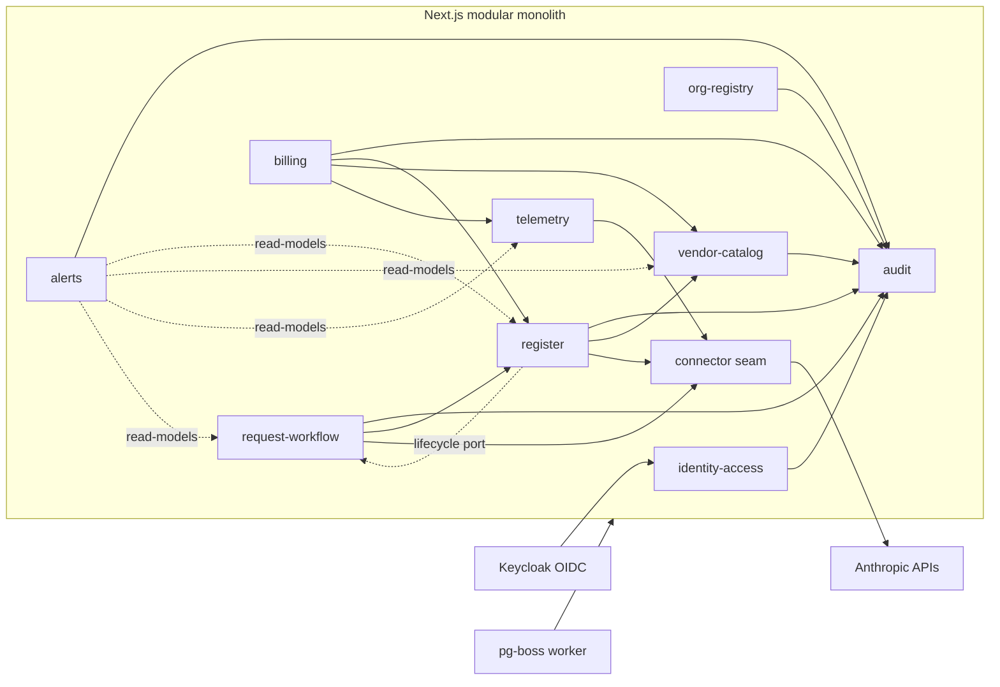
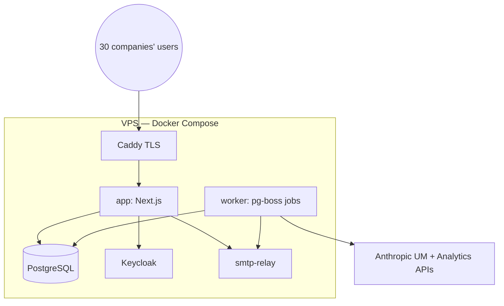

# 09 — Architecture: Ledger (`fcostudios__smp`)

**Step:** 9 — Architecture · **Date:** 2026-07-22 · **Report language:** en-US
**Inputs:** `04_er_model.md` (26 entities/8 contexts) · `08_scope.md` (54 stories, 44 server actions) · PRD §13/§15 · DEC-SMP-001..013 · `extracts/_step8_coherence_pack.json`
**Resolves:** OQ-SMP-2 → **DEC-SMP-014 (Keycloak IdP)** · OQ-SMP-3 → **DEC-SMP-015 (pg-boss)** · OQ-SMP-11 → **DEC-SMP-016 (Central Finance owns the override; Group Admin fallback)** · capacity-action consolidation (ADR-06).

---SECTION: SEC0---

## Executive Summary

Ledger is a **modular monolith**: one Next.js (App Router) application whose modules mirror the ER's 8 bounded contexts, one PostgreSQL database carrying the DB-level guarantees (register EXCLUDE + contiguity trigger + append-only grants), a **pg-boss** worker for all periodic jobs, **Keycloak** (self-hosted, same Compose stack) for authentication, and a **connector seam** that keeps everything vendor-specific behind one interface (DEC-SMP-008). No separate API tier; server actions are the application API, each owned by exactly one module. Deployment is Docker Compose on a VPS (< $100/mo): `app`, `worker`, `postgres`, `keycloak`, `smtp-relay`.

---SECTION: SEC1---

## Module Map (bounded contexts → app modules)

| Module | ER context | Owns (entities) | Server actions (owned) |
|---|---|---|---|
| `identity-access` | org_registry (identity slice) | UserAccount, CompanyRoleAssignment | login, createUserAccount, disableUserAccount, resetTwoFactor, addCompanyRole, removeCompanyRole |
| `org-registry` | org_registry_context | Company, Person | createCompany, updateCompany, importCompaniesCsv, createPerson, updatePerson |
| `vendor-catalog` | vendor_catalog_context | Vendor, VendorAccount, VendorAccountCapacity, LicenseType, IntegrationCredential | createVendorAccount, updateVendorAccount, saveVendorAccountCapacity (canonical — ADR-06: registerPurchase/addCapacity are UI entry points), verifyCredential, rotateCredential |
| `request-workflow` | request_workflow_context | LicenseRequest, RequestTransition | submitRequest, decideRequest, startOffboarding, retryProvisioning, withdrawInvite, confirmChecklistDone, markChecklistNotDone |
| `register` | register_context | LicenseAssignment, ProvisioningAction, ReclamationProposal | claimDriftMember, proposeReclamations, approveReclamation, dismissReclamation, exportRegisterCsv |
| `telemetry` | telemetry_context | ActivityRecord, CostRecord | (job-written only) |
| `billing` | billing_context | RateCard, CloseRun, Statement, StatementLine, Reconciliation, ReconciliationVarianceLine | saveRateCard, runClose, finalizeStatements, finalizeStatement, exportStatementCsv, exportStatementPdf, exportRollupCsv, exportRollupPdf, saveInvoiceAmount, overrideReconciliation |
| `alerts` | alerts_context | AlertRule, AlertEvent, SystemSetting | ackAlert, saveAlertRules, saveNotificationSettings, saveSystemSettings |
| `audit` | audit_context | AuditLog | (written by every module via the audit port) |

Dependency allow-list (the boundary-lint's single authority; the diagram is generated from it): every module → `audit` + `identity-access` (authz port); `request-workflow` → `register`, `connector`; `register` → `vendor-catalog`, `connector`, and `request-workflow` **via the `lifecycle-engine` port only** (in `packages/contracts`, mirroring the audit port — used for claim-materialized requests US-030, flagged_inactive US-027, reclamation-approved offboarding US-028; port edges are acyclic by construction); `telemetry` → `connector`; `billing` → `register`, `telemetry`, `vendor-catalog` (read-models only); `alerts` → `register`, `vendor-catalog`, `telemetry`, `request-workflow` (read-models only, for BR-08/11/12/23 evaluation). No other edges, no cycles.

---SECTION: SEC2---

## Architecture Decision Records

### ADR-01 — Modular monolith on Next.js App Router; server actions are the API
One deployable app; module boundaries per SEC1; server actions validated with zod contracts from `packages/contracts`; no REST tier in R1 (PRD §13). Route handlers only for exports (CSV/PDF streams) and OIDC callbacks.

### ADR-02 — PostgreSQL + Drizzle, raw-SQL migrations for the guarantees
Drizzle owns the schema; a raw-SQL migration layer (same migration chain) carries what Drizzle cannot express: `btree_gist` EXCLUDE (register no-overlap), the deferred transfer-contiguity constraint trigger, the partial UNIQUE on pending ReclamationProposal, `REVOKE UPDATE, DELETE ON audit_log` (BR-03), **REVOKE DELETE on all core tables** (CompanyRoleAssignment excepted per 04 SEC6), and **column-level UPDATE grants on the append-only tables** (LicenseAssignment: ended_on, end_reason; ProvisioningAction: status, sent_at, resolved_at; AlertEvent: acknowledged_by, acknowledged_at; RequestTransition: none) — BR-28. CI applies migrations against a throwaway DB and runs the integrity tests (US-003).

### ADR-03 — Keycloak is the IdP (DEC-SMP-014, supersedes the email+password module in PRD §13's directional sketch)
Self-hosted Keycloak in the Compose stack; one realm `corporativo`; OIDC authorization-code flow via Auth.js's Keycloak provider. **TOTP enforced by realm policy for members of the `platform-admin` group** (Module H's mandatory-2FA rule delegated to the IdP). Ledger keeps **authorization** in its DB: `UserAccount.idp_subject` (new attr) links the OIDC subject; roles/grants stay in UserAccount.global_role + CompanyRoleAssignment — Keycloak carries NO business roles (one source of authz truth, HR-42-style enrichment pattern). `password_hash`/`totp_secret_encrypted` become **unused under Keycloak** (retained for the break-glass profile below). SSO for the wider building (R2's OIDC item) becomes configuration, not code.
**Keycloak admin-client seam:** `identity-access` owns a Keycloak admin client (service account, realm `corporativo`): (a) any grant/revoke that makes/unmakes an admin (`global_role ∈ {group_admin, central_finance}`) syncs `platform-admin` group membership; (b) `resetTwoFactor` deletes the user's Keycloak OTP credential and sets the `CONFIGURE_TOTP` required action (still audit-logged with the mandatory note); (c) `disableUserAccount` disables the Keycloak user and revokes active sessions; (d) 2FA estado is read from Keycloak's credential state for the `idp_subject` (not from `totp_secret_encrypted`). An admin-role UserAccount whose subject lacks the group is a startup/audit error.
**Break-glass contract:** enabled only via a deploy-time flag; credential is a sealed one-time secret injected as a Compose secret at enablement (never a standing DB password); local login enforces TOTP via `totp_secret_encrypted`; enabling raises a system alert; every break-glass login writes an AuditLog row flagged `break_glass`; the profile auto-disables on first successful login and after 24 h.

### ADR-04 — pg-boss on the same Postgres (DEC-SMP-015)
No Redis. Schedules per US-046 (analytics daily, member sync hourly, invite polling 15 min, alert eval 15 min — which also evaluates aging reminders/escalations and watchdogs, BR-08/BR-27 —, close bd-3 via business-day pre-check job). Idempotency: singleton keys per (job, period/org); every run logged with duration; failures raise alert-path events, never die silently (PRD §13).

### ADR-05 — Connector seam (DEC-SMP-008)
`packages/connectors`: `capabilities()` + provision/deprovision/syncMembers/syncActivity/syncCost; dispatch by `Vendor.provisioning_protocol` (rest/scim/none); unsupported *provisioning* capability ⇒ orchestration checklist ProvisioningAction (DEC-SMP-007); unsupported *sync* capability (or `VendorAccount.ingestion_mode ∈ {csv_import, manual}`) ⇒ the API-less ingestion path (DEC-SMP-018, US-055): `importMembersCsv`/`importUsageCsv` parse Console exports into the SAME upserts/diffs the API sync writes (source provenance on ActivityRecord/CostRecord), and manual register upkeep runs under the same DB-level integrity + audit. An org on a Claude Teams plan (no Admin/Analytics API) is fully manageable on this path. Anthropic connector #1: rate limiters (100/min UM, 60/min analytics, 1 200 invites/h), `anthropic-version` + beta header pinned in ONE module, raw request/response persisted on every call. Core modules import the interface only (lint guard).

### ADR-06 — One capacity-write command
Domain command `saveVendorAccountCapacity` is the single write path for capacity rows. Entry points and reasons: SCR-pools `registerPurchase` ⇒ reason=purchase; SCR-vendor-account-detail `addCapacity` ⇒ reason=purchase|correction (operator-chosen); SCR-rates invokes `saveVendorAccountCapacity` directly ⇒ reason=correction. `registerPurchase` and `addCapacity` survive as thin exported wrappers delegating to `saveVendorAccountCapacity` (the 44-action contract and the TOONs are unchanged); domain logic lives only in the canonical command.

### ADR-07 — Reconciliation override authority (DEC-SMP-016)
`central_finance` performs and owns the tolerance override (journeys/§18 reading); `group_admin` retains it as operational fallback (Module E AC reading). Enforcement server-side on `overrideReconciliation`; `overridden_by` unrestricted FK + role check in the action. OQ-SMP-11 closed.

### ADR-08 — Audit port
Every module mutation goes through `withAudit(actor, action, entity, note?)` which writes the row + before/after diff in the same transaction; append-only guaranteed by ADR-02 grants. Job/system actors write with `actor_user_id = NULL`.

### ADR-09 — Email via SMTP relay
Nodemailer against a Compose `smtp-relay` (host-configurable to the building's SMTP or a transactional provider); templates from the shared next-intl catalogs (US-016 voice constraint); sender/escalation from SystemSetting.

### ADR-10 — Statement PDFs with @react-pdf/renderer
Deterministic server-side rendering (no headless browser in the stack); corporativo. template (US-049); language per `Company.statement_language`; golden-file tested.

### ADR-13 — Secrets & key management
libsodium sealed-box envelope encryption; one KEK per environment supplied as a Docker Compose secret (never stored in Postgres or the repo); DEK per IntegrationCredential row wrapped by the KEK; KEK rotation = re-wrap all DEKs (documented procedure, no credential re-entry); nightly `pg_dump` encrypted with a distinct backup key (age) whose escrow location is named in the US-048 restore runbook.

### ADR-11 — Deployment & ops
Compose services: `app`, `worker`, `postgres`, `keycloak`, `smtp-relay`. Nightly `pg_dump` encrypted backups + documented restore drill (US-048); healthchecks per service; TLS terminated by the host reverse proxy (Caddy). Hosting target < $100/mo (PRD §17).

### ADR-12 — Observability (right-sized)
Structured JSON logs; job-run table (pg-boss archive) + CloseRun for business-visible runs; freshness surfaced in-product (BR-23) instead of an external APM in R1.

---SECTION: SEC3---

## NFR → mechanism accountability (PRD §15)

| NFR | Mechanism | Story |
|---|---|---|
| Security (secrets, TLS, RBAC, 2FA, append-only audit) | ADR-13 envelope encryption + KEK handling; Caddy TLS; ADR-03 TOTP realm policy + admin seam; ADR-02 grants; ADR-08 | US-004/005/008/031/048 |
| Data isolation (company_id, test coverage) | authz port resolves permitted set; every repository query filtered; CI isolation suite | US-005/047 |
| Reliability (idempotent jobs, alert on failure) | ADR-04 singletons + alert path; connector retries/backoff | US-046/042 |
| Correctness (register integrity at DB level) | ADR-02 EXCLUDE + trigger; close re-verification defense-in-depth | US-003/034 |
| Performance (dashboards <3s @ scale; close <5min) | aggregate read-models + indexes; CI perf fixture (US-040 AC4); close batching per company | US-040/034 |
| Maintainability (connector <2wk; runbooks) | ADR-05 seam + capability descriptor; US-048 runbooks | US-045/048 |
| Auditability (figure → rows → raw payloads) | StatementLine.assignment_id chain + raw-payload viewers; AuditLog | US-033/036 |

---SECTION: SEC4---

## Open items carried

- Keycloak realm bootstrap (realm export in repo, seeded users for CI) — lands in US-004 (re-scoped to OIDC; see scope amendment note).
- ER ripple applied: `UserAccount.idp_subject` added; password/TOTP columns marked unused-under-Keycloak (04 SEC3 note). ADR-03 ripple also re-scopes US-011: `resetTwoFactor` becomes a Keycloak Admin API call and 2FA estado reads Keycloak credential state, not `totp_secret_encrypted`.
- R2 SSO = enabling the building's upstream IdP as a Keycloak identity provider (config only).
